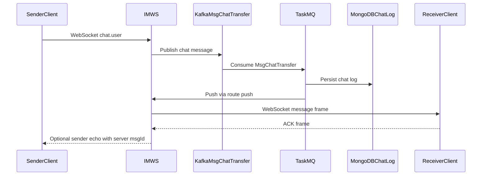
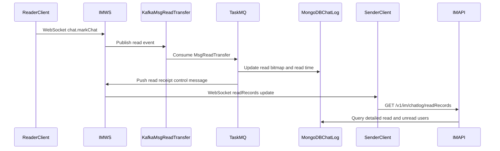
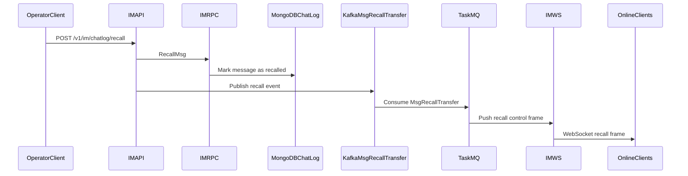
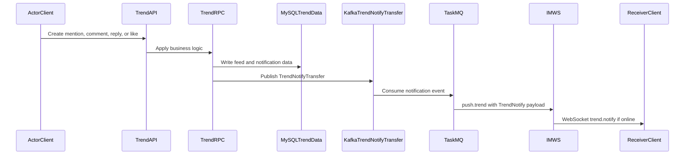
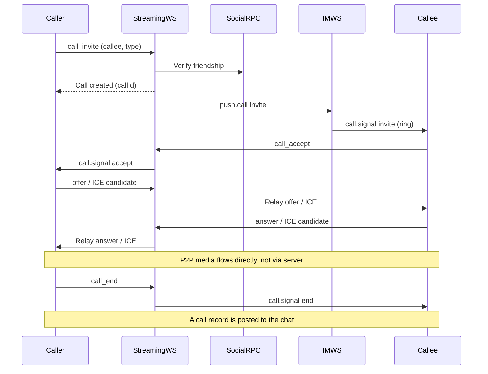
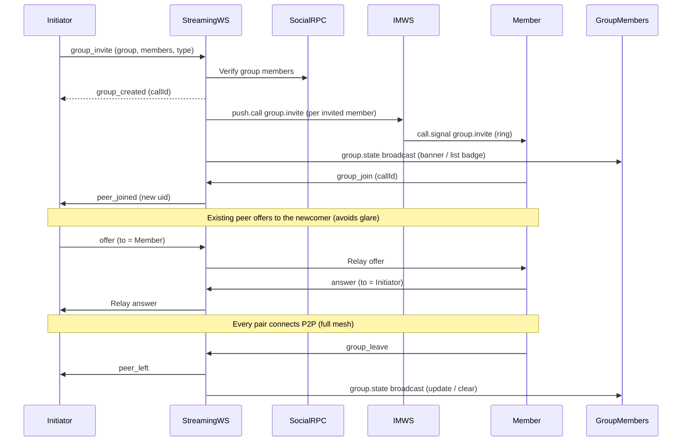

<p align="center">
  
</p>

# go-hichat-api

[English](README.md) | [简体中文](docs/README.zh-CN.md)

go-hichat-api is the backend and web client repository for HiChat 2.0, a go-zero based instant messaging and social platform. It combines REST APIs, zRPC services, WebSocket long connections, Kafka async pipelines, MongoDB chat storage, MySQL business data, Redis runtime state, and an independent WebRTC streaming service.

The repository is intended as a practical reference for building a modern IM system with clear service boundaries, message delivery, read receipts, online presence, activity notifications, media messages, social relationships, activity feeds, and a Next.js web client.

## Highlights

- Microservice architecture built on go-zero REST and zRPC.
- API-first contracts through `.api` and `.proto` files.
- WebSocket gateway for authentication, heartbeat, online state, message ACK, read receipts, and real-time push.
- Kafka pipeline for chat delivery, read events, message recall, activity notifications, and background processing.
- MongoDB for chat logs, MySQL for business data, Redis for sessions, cache, online state, and runtime coordination.
- Independent WebRTC streaming service for calls, meetings, screen sharing, live streaming, rooms, and SFU workflows.
- Full web client under `web/` using Next.js 16, React 19, Bun, TypeScript, Tailwind CSS, and Semi UI.

## Core Capabilities

| Domain | Capabilities |
| --- | --- |
| User and account | Phone/password login, JWT issuing, phone/email verification codes, password reset, profile management, avatar upload, account deactivation, user search, and internal user lookup RPCs. |
| Social graph | Friend requests, friend list, remarks, blocking, moments permissions, notification settings, tags, friend reports, and online status queries. |
| Groups | Group creation, search, join requests, invitations, invite tokens, member management, announcements, roles, admin operations, ownership transfer, and group mentions. |
| Instant messaging | Single and group conversations, conversation pin/mute, MongoDB chat history, text/file/voice/image/video messages, quotes, mentions, unread state, read records, recall, and media upload. |
| Realtime gateway | WebSocket authentication, route dispatch, Redis-backed online state, Kafka message publishing, server push, ACK tracking, retry handling, duplicate filtering, and trend notifications. |
| Activity feed | Trend publishing, visibility control, media resources, comments, replies, likes, drafts, unread counters, message notifications, and online push. |
| Async tasks | Kafka consumers for chat, read, recall, and trend notification events, plus cron task extension points. |
| Streaming | WebRTC one-to-one calls, group calls, meetings, screen sharing, live streaming, signaling, rooms, and SFU components. |
| Web client | Next.js application with Bun scripts, TypeScript, Tailwind CSS, Semi UI, and a development server on port `3001`. |

## Architecture

```text
┌──────────────────────────────────────────────────────────────────────────────┐
│ L0 Client Layer                                                              │
│                                                                              │
│  Web Client (web/: Next.js + React)        Mobile / Third-party Clients       │
└───────────────┬────────────────────────────┬───────────────────────────┬─────┘
                │ REST                       │ WebSocket                 │ WebRTC
                ▼                            ▼                           ▼
┌──────────────────────────────────────────────────────────────────────────────┐
│ L1 Access Layer                                                              │
│                                                                              │
│  HTTP APIs                         Realtime Access              Media Access  │
│  ┌─────────────────────────────┐   ┌───────────────────────┐    ┌──────────┐ │
│  │ user/api   social/api       │   │ im/ws                 │    │streaming │ │
│  │ im/api     trend/api        │   │ auth heartbeat ack    │    │signaling │ │
│  │ REST routes + JWT context   │   │ online push routing   │    │rooms SFU │ │
│  └──────────────┬──────────────┘   └───────────┬───────────┘    └────┬─────┘ │
└─────────────────┼──────────────────────────────┼─────────────────────┼───────┘
                  │ zRPC                         │ publish/consume      │ Redis
                  ▼                              ▼                     ▼
┌──────────────────────────────────────────────────────────────────────────────┐
│ L2 Domain Service Layer                                                      │
│                                                                              │
│  ┌────────────┐  ┌──────────────┐  ┌────────────┐  ┌──────────────┐          │
│  │ user/rpc   │  │ social/rpc   │  │ im/rpc     │  │ trend/rpc    │          │
│  │ auth       │  │ friends      │  │ convo      │  │ feed         │          │
│  │ profile    │  │ groups       │  │ chat logs  │  │ comments     │          │
│  │ verify     │  │ requests     │  │ read/recall│  │ likes/notify │          │
│  └─────┬──────┘  └──────┬───────┘  └─────┬──────┘  └──────┬───────┘          │
└────────┼────────────────┼────────────────┼────────────────┼─────────────────┘
         │                │                │                │
         │ MySQL          │ MySQL          │ MongoDB        │ MySQL + Kafka
         ▼                ▼                ▼                ▼
┌──────────────────────────────────────────────────────────────────────────────┐
│ L3 Event And Async Layer                                                     │
│                                                                              │
│  Kafka Topics                                                                │
│  ┌────────────────┐ ┌───────────────┐ ┌────────────────┐ ┌───────────────┐  │
│  │ chat-transfer  │ │ read-transfer │ │ recall-transfer│ │ trend-notify  │  │
│  └───────┬────────┘ └──────┬────────┘ └───────┬────────┘ └──────┬────────┘  │
│          └─────────────────┴──────────┬───────┴─────────────────┘           │
│                                        ▼                                     │
│  apps/task/mq: persist chat, update read state, push recall/feed events       │
│  apps/task/cron: scheduled stats, cleanup, and extension jobs                 │
└────────────────────────────────────────┬─────────────────────────────────────┘
                                         │ persist/update/push
                                         ▼
┌──────────────────────────────────────────────────────────────────────────────┐
│ L4 Data And Runtime Infrastructure                                           │
│                                                                              │
│  MySQL: users, friends, groups, trends, comments, likes, notifications        │
│  MongoDB: chat logs, read records, recall state                              │
│  Redis: session/JWT state, online presence, cache, WS runtime, room state     │
│  Etcd: service registration and discovery for go-zero RPC services            │
└──────────────────────────────────────────────────────────────────────────────┘

Key Connections
1. Web/Mobile -> HTTP APIs -> zRPC -> Domain RPC -> MySQL/MongoDB.
2. Web/Mobile -> im/ws -> Kafka -> task/mq -> MongoDB + im/ws push.
3. trend/rpc -> Kafka trend-notify -> task/mq -> im/ws -> online clients.
4. RPC services register in Etcd; API services discover RPC endpoints from Etcd.
5. im/ws and streaming use Redis for online state, sessions, cache, and room state.
```

## Message Flows

### Chat Delivery



### Read Receipt



### Message Recall



### Activity Notification



## Voice / Video Calls

The independent `streaming` service delivers WebRTC real-time audio/video. Call **control** signaling reuses the im ws channel (`push.call` → client `call.signal`); **media negotiation** (offer/answer/ICE) runs over the streaming service's own WebSocket relay, while the media itself flows **peer-to-peer and never touches the server**. One-to-one is direct P2P; group calls use a **full-mesh** topology (each pair connects directly, up to 4 participants). SFU and TURN are reserved extension points for meetings, live streaming, and stricter NAT traversal.

### One-to-one Call



### Group Call (Mesh)



## Services

| Service | Layers | Responsibility |
| --- | --- | --- |
| `user` | `api`, `rpc`, `models` | Account, authentication, profile, verification codes, user lookup |
| `social` | `api`, `rpc`, `socialmodels` | Friends, friend requests, groups, group members, invite links, announcements |
| `im` | `api`, `rpc`, `ws`, `models`, `immodels` | Conversations, chat logs, read receipts, message recall, WebSocket gateway |
| `trend` | `api`, `rpc`, `models` | Activity feed, comments, likes, drafts, media, activity notifications |
| `task` | `mq`, `cron` | Kafka consumers and scheduled jobs |
| `streaming` | `internal`, `room`, `sfu`, `webrtc` | WebRTC calls, rooms, meetings, screen sharing, live streaming |
| `demo` | standalone demo | Internal demo service, not part of the main startup script |

## Tech Stack

- Backend: Go 1.23, toolchain Go 1.24.2, go-zero, zRPC, gRPC, goctl.
- Realtime: WebSocket, Kafka, WebRTC, Pion.
- Storage: MySQL, MongoDB, Redis.
- Service discovery: Etcd.
- Frontend: Next.js 16, React 19, Bun, TypeScript, Tailwind CSS, Semi UI.

## Repository Layout

Generated with `tree -L 2`.

```text
.
├── CLAUDE.md
├── LICENSE
├── README.md
├── apps
│   ├── im
│   ├── social
│   ├── streaming
│   ├── task
│   ├── trend
│   └── user
├── cmd
├── common
├── config
│   ├── config-local.yaml
│   └── config-sample.yaml
├── deploy
│   ├── dockerfile
│   ├── sql
│   ├── sql_init.go
│   └── trendmig
├── docker-compose.yaml
├── docs
│   ├── README.zh-CN.md
│   ├── api.md
│   ├── development-guide.md
│   ├── imgs
│   └── specs
├── go.mod
├── go.sum
├── hichat2.sh
├── logs
│   ├── im-api
│   ├── im-im
│   ├── im-rpc
│   ├── im-ws
│   ├── social-api
│   ├── social-rpc
│   ├── task-mq
│   ├── task-task
│   ├── trend-api
│   ├── trend-rpc
│   ├── user-api
│   └── user-rpc
├── pkg
│   ├── 2fa
│   ├── bitmap
│   ├── config
│   ├── constants
│   ├── ctxdata
│   ├── db
│   ├── encrypt
│   ├── errors
│   ├── http
│   ├── interceptor
│   ├── logger
│   ├── message
│   ├── relationcache
│   ├── sensitive
│   ├── storage
│   ├── systemconfig
│   ├── test
│   ├── transaction
│   ├── utils
│   ├── wuid
│   └── xerr
├── resources
│   └── sensitive
├── temp
│   ├── avatar
│   ├── emoji
│   ├── favorite
│   ├── im
│   ├── img.png
│   ├── img_1.png
│   ├── img_2.png
│   ├── img_3.png
│   ├── img_4.png
│   └── trend
├── test.sh
└── web
    ├── Caddyfile
    ├── bun.lock
    ├── components.json
    ├── dev.log
    ├── dist
    ├── download
    ├── eslint.config.mjs
    ├── examples
    ├── next-env.d.ts
    ├── next.config.ts
    ├── node_modules
    ├── package.json
    ├── postcss.config.mjs
    ├── public
    ├── scripts
    ├── src
    ├── tailwind.config.ts
    ├── tsconfig.json
    ├── tsconfig.tsbuildinfo
    ├── upload
    └── worklog.md

71 directories, 32 files
```

## Getting Started

### One-Click Deploy (Docker Compose)

The fastest way to run the whole stack (6 microservices + middleware + web client) with a single command — no local toolchain needed, just Docker:

```bash
docker compose up -d --build
```

Then open **http://localhost:2470**. On first use click **Register** — in demo mode the verification code is auto-filled into the input box (no real SMS), so you can sign up and log in right away.

```bash
docker compose ps            # service status
docker compose logs -f web   # follow a service's logs
docker compose down          # stop (keep data)
docker compose down -v       # stop and wipe all data volumes
```

See the [Docker deployment guide](deploy/docker/README.md) for architecture, ports, server/domain (reverse proxy + HTTPS) deployment, and audio/video (TURN) notes.

### Prerequisites

- Go 1.23 or newer, using toolchain Go 1.24.2.
- Bun for the web client.
- MySQL, Redis, Etcd, MongoDB, and Kafka.
- go-zero tooling: `goctl`, `protoc`, `protoc-gen-go`, and `protoc-gen-go-grpc`.

See [Developer Guide](docs/development-guide.md) for local dependency setup and code generation notes.

### Start Backend Services

Start the required infrastructure first, then run the main backend services:

```bash
./hichat2.sh
```

The script starts the user, social, IM, task, and trend services, and writes logs under `logs/`.

Start a single service manually when needed:

```bash
go run apps/<service>/<layer>/<service>.go -f apps/<service>/<layer>/etc/<service>-sample.yaml
```

Start the streaming service separately:

```bash
apps/streaming/start.sh
```

### Start Web Client

```bash
cd web
bun install
bun dev
```

The web development server runs on port `3001` by default.

## Development

- [Developer Guide](docs/development-guide.md): local middleware setup, go-zero tooling, code generation, startup notes, and Docker examples.
- [API Reference](docs/api.md): generated REST and gRPC contract summary.
- [Feature Specs](docs/specs): feature analysis, design notes, and implementation records.

## Testing

Run backend tests from the repository root:

```bash
go test ./... -count=1
```

Run frontend linting from `web/`:

```bash
bun lint
```

## Contributing

Please see the [Contribution Guide](https://github.com/iceymoss/go-hichat-api/issues/207) for contribution guidelines.

## License

This project is licensed under the [Apache License 2.0](LICENSE).
