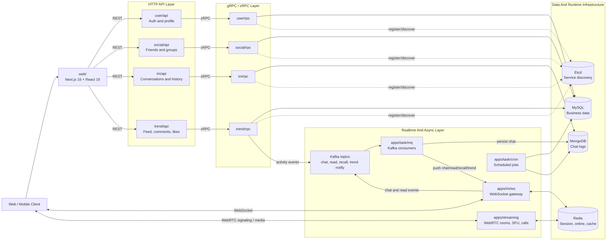
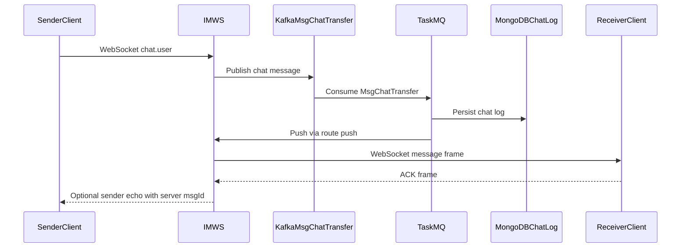
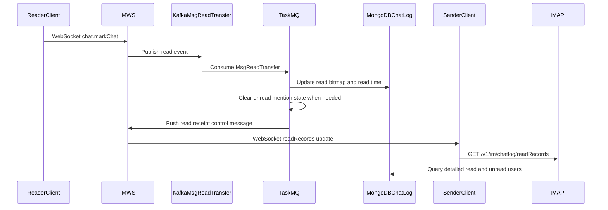
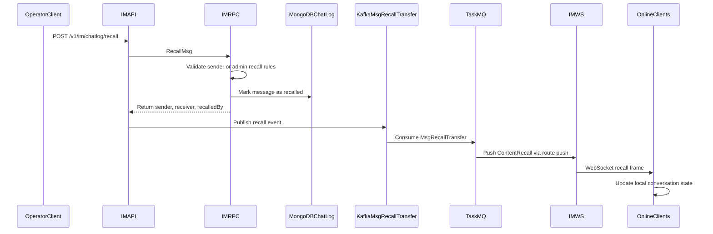
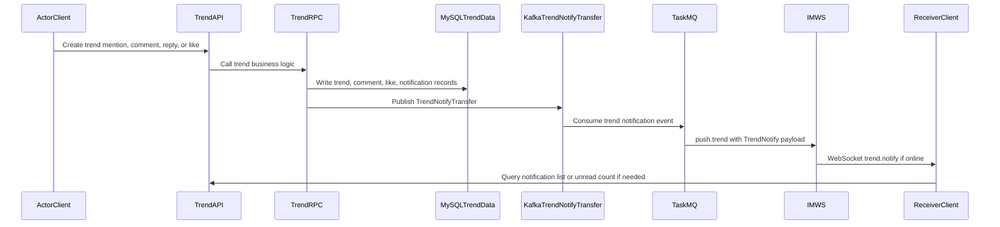

# go-hichat-api

[English](README.md) | [简体中文](docs/README.zh-CN.md)

go-hichat-api is the backend and web client repository for HiChat 2.0, a microservice-based instant messaging and social platform built with Go, go-zero, WebSocket, Kafka, and WebRTC.

The project splits user identity, social relationships, conversations, message delivery, activity feeds, async tasks, and real-time audio/video into independent services. It is intended as a practical reference for building a modern IM system with HTTP APIs, gRPC service boundaries, persistent chat history, online presence, read receipts, message acknowledgements, activity notifications, and a Next.js web client.

## Highlights

- Microservice architecture based on go-zero REST and zRPC.
- API-first contracts through `.api` and `.proto` files.
- WebSocket gateway for long-lived IM connections, heartbeat, online state, message ACK, read receipts, and real-time push.
- Kafka-based async message pipeline for chat delivery, read events, message recall, and activity notifications.
- MongoDB-backed chat history and MySQL-backed business data.
- Redis-backed sessions, online presence, cache, and runtime state.
- Independent WebRTC streaming service for calls, rooms, meetings, screen sharing, and live streaming.
- Full web client under `web/` using Next.js 16, React 19, Bun, TypeScript, Tailwind CSS, and Semi UI.

## Features

### User And Account

- Register and log in with phone number and password.
- Issue JWT tokens with expiration metadata.
- Send and verify phone verification codes.
- Send and verify email verification codes.
- Reset passwords by phone or email verification code.
- Query current user profile.
- Update nickname, phone, avatar, gender, introduction, region, occupation, personal tags, password, and moments cover.
- Upload user avatars.
- Bind or update email addresses.
- Search users by fuzzy nickname or exact phone, email, and user ID list.
- Delete or deactivate the current account through logout/delete flow.
- Internal RPC lookup by user ID, phone, and email for cross-service enrichment.

### Social Graph

- Send friend requests with request messages and preset remarks.
- Accept, reject, ignore, mark read, list, and delete friend requests.
- Count unread friend request messages.
- List friends with enriched profile data.
- Update friend remarks.
- Delete friendships bidirectionally.
- Block or unblock friends.
- Configure friend moments permissions: allow, chat-only, or block moments.
- Toggle friend message notifications, pinning, and mute state.
- Manage friend tags.
- Report friends and reserve friend sharing workflows.
- Query friends' online status.

### Groups

- Create groups with name and icon.
- Search groups by exact group ID or fuzzy group name with pagination.
- Apply to join groups, invite members, and join by invite token.
- Process group join requests and list requests from group or user perspectives.
- List joined groups and group members.
- Query group details with group metadata and members.
- Query group members' online state.
- Quit groups, kick members, and invite friends into groups.
- Update group name, icon, announcement text, verification mode, and description.
- Disband groups, transfer ownership, and set or cancel administrators.
- Create, list, revoke, and consume invite links or QR-code tokens with optional expiration and max-use limits.
- Manage per-member group nickname and group remark.
- Provide group mention lists for `@member` selection.
- Publish group announcements, list announcement history, and pin or unpin announcements.
- Query member role for permission checks.

### Instant Messaging

- Create single-chat and group-chat conversations.
- List and update conversations per user.
- Pin or mute conversations.
- Store chat logs in MongoDB.
- Query chat history by conversation, message ID, time range, count, and direction: older, newer, or around.
- Support text, file, voice, image, and video message types.
- Support quoted/replied messages.
- Support group mentions and `@all` metadata.
- Track unread state and per-message read records.
- Query read and unread users for a message.
- Mark messages as read and push read receipts through the async pipeline.
- Fetch unread `@me` messages for quick jumping in group chats.
- Recall messages through a control frame, with operator metadata for sender/admin recall scenarios.
- Upload rich media files for images, videos, voice messages, and generic files.

### WebSocket Gateway

- Authenticate WebSocket clients.
- Maintain online state in Redis with TTL refresh.
- Register routes for `user.online`, `chat.ping`, `chat.user`, `chat.markChat`, `push`, and `push.trend`.
- Deliver client chat messages from WebSocket to Kafka.
- Push Kafka-consumed chat messages from server to connected clients.
- Push activity notifications independently from chat conversations.
- Support configurable ACK levels, ACK sequence tracking, retries, timeout handling, and duplicate filtering.
- Handle read-message events and dispatch them to MQ.
- Push trend notifications for likes, comments, replies, trend mentions, and comment mentions.

### Activity Feed

- Create text, mixed-media, article, share, video, and ad-style trends.
- Configure visibility scopes: private, friends-only, or public.
- Attach image/video resources, cover URLs, share URLs, location, coordinates, device, IP, title, and mentioned users.
- Delete and update trends.
- Pin trends, change visibility, and toggle comments.
- List trends with cursor-style pagination, type filters, sorting, and user filters.
- Fetch latest feed pages and user profile trends.
- Fetch trend details.
- Retrieve publish configuration such as media limits, allowed types, compression flags, and review flags.
- Upload trend media with metadata such as content type, size, dimensions, duration, and cover URL.
- Save, fetch, and delete trend drafts.

### Comments, Likes, And Activity Notifications

- Create root comments and child comments.
- Fetch full comment trees, root comments, and child comment lists.
- Delete comments.
- Mark comment notifications as read.
- Toggle likes and unlikes.
- Fetch like summaries for one trend or a batch of trends.
- List users who liked a trend.
- Fetch unread reply and like notifications.
- Mark likes as read.
- Store and list trend message notifications.
- Fetch trend-message unread counts with per-type breakdowns.
- Mark all trend messages as read.
- Emit activity notification events to Kafka and push them to online users through WebSocket.

### Async Tasks

- Consume chat-transfer messages from Kafka.
- Persist chat messages and forward them to WebSocket clients.
- Consume read-transfer messages, update read-record bitmaps, and send read receipts.
- Consume recall-transfer messages and push recall control frames.
- Consume trend-notification messages and push activity notifications.
- Run cron task manager with registered example, stats, and data-cleanup tasks.
- Provide extension points for additional scheduled jobs.

### Streaming

- Provide a standalone WebRTC streaming service.
- Support one-to-one calls, group calls, meetings, screen sharing, and live streaming workflows.
- Use WebSocket signaling for call negotiation and WebRTC for media transport.
- Manage rooms, users, calls, meetings, screen sharing, and live streams.
- Include SFU-related components for room-level media forwarding.
- Provide quick and comprehensive browser test pages.

### Web Client

- Next.js 16 application under `web/`.
- React 19 and TypeScript frontend stack.
- Bun-based install, development, build, and production start scripts.
- Tailwind CSS and Semi UI based interface.
- Frontend development server runs on port `3001` by default.

## Architecture



Core infrastructure:

- MySQL stores business data such as users, friends, groups, and trends.
- MongoDB stores chat records.
- Redis stores sessions, online state, cache data, and runtime state.
- Etcd provides go-zero service registration and discovery.
- Kafka decouples chat delivery, read events, recall events, and activity notification processing.

## Message Flows

### Chat Message Delivery



### Read Receipt Path



### Message Recall Path



### Activity Notification Path



## Services

| Service | Layers | Responsibility |
| --- | --- | --- |
| `user` | `api`, `rpc`, `models` | Account, authentication, profile, verification codes, user lookup |
| `social` | `api`, `rpc`, `socialmodels` | Friends, friend requests, groups, group members, invite links, announcements |
| `im` | `api`, `rpc`, `ws`, `models`, `immodels` | Conversations, chat logs, read receipts, message recall, WebSocket gateway |
| `trend` | `api`, `rpc`, `models` | Activity feed, comments, likes, drafts, media, activity notifications |
| `task` | `mq`, `cron` | Kafka consumers and scheduled jobs |
| `streaming` | `internal`, `room`, `sfu`, `webrtc` | WebRTC calls, rooms, meetings, screen sharing, live streaming |
| `demo` | standalone demo | Internal demo service, not part of the main startup script |

## Tech Stack

- Backend: Go 1.23, toolchain Go 1.24.2, go-zero, zRPC, gRPC, goctl.
- Realtime: WebSocket, Kafka, WebRTC, Pion.
- Storage: MySQL, MongoDB, Redis.
- Service discovery: Etcd.
- Frontend: Next.js 16, React 19, Bun, TypeScript, Tailwind CSS, Semi UI.

## Repository Layout

```text
apps/                  Backend services
  user/                User API, RPC, and models
  social/              Social relationship API, RPC, and models
  im/                  IM API, RPC, models, and WebSocket gateway
  trend/               Activity feed API, RPC, and models
  task/                MQ consumers and cron jobs
  streaming/           WebRTC streaming service
  demo/                Internal demo service
deploy/                SQL files, Dockerfiles, and deployment assets
docs/                  Project documentation
web/                   Next.js web client
hichat2.sh             Local multi-service startup script
```

## Getting Started

### Prerequisites

- Go 1.23 or newer, using toolchain Go 1.24.2.
- Bun for the web client.
- MySQL, Redis, Etcd, MongoDB, and Kafka.
- go-zero tooling: `goctl`, `protoc`, `protoc-gen-go`, and `protoc-gen-go-grpc`.

See `docs/development-guide.md` for detailed local dependency setup commands.

### Start Backend Services

Start the main backend services after the required infrastructure is running:

```bash
./hichat2.sh
```

The script starts the user, social, IM, task, and trend services, and writes logs under `logs/`.

Start a single service manually when needed:

```bash
go run apps/<service>/<layer>/<service>.go -f apps/<service>/<layer>/etc/<service>-sample.yaml
```

Start the streaming service separately:

```bash
apps/streaming/start.sh
```

### Start Web Client

```bash
cd web
bun install
bun dev
```

The web development server runs on port `3001` by default.

## Development

For code generation, database model generation, Docker examples, and local middleware setup, see:

- [Developer Guide](docs/development-guide.md): local middleware setup, go-zero tooling, code generation, startup notes, and Docker examples.
- [API Reference](docs/api.md): generated REST and gRPC contract summary.

## Testing

Run backend tests from the repository root:

```bash
go test ./... -count=1
```

Run frontend linting from `web/`:

```bash
bun lint
```

## License

This project is licensed under the [Apache License 2.0](LICENSE).

## Contributing

Please see [Contribution Guide](https://github.com/iceymoss/go-hichat-api/issues/207) for contribution guidelines.
