# 视频通话服务工作流程详解

本文档详细说明了基于 WebRTC 的一对一视频通话服务的完整工作流程。

---

## 🏗️ 架构概览

这是一个基于 **WebRTC** 的**一对一视频通话应用**，采用 Go 后端信令服务器 + 原生 JavaScript 前端的架构。

**核心组件:**
- **Go 后端**: 提供 WebSocket 信令服务器，负责客户端配对和消息转发
- **JavaScript 前端**: 使用浏览器原生 WebRTC API 实现音视频通话
- **STUN 服务器**: 用于 NAT 穿透，帮助建立 P2P 连接

---

## 📊 完整工作流程

### **阶段 1: 服务启动** (`demo.go`)

```
┌─────────────────────────────────────┐
│  加载配置文件 (demo.yaml)            │
│  - 监听地址: 0.0.0.0                 │
│  - 端口: 8890                        │
│  - STUN 服务器配置                   │
└──────────────┬──────────────────────┘
               ↓
┌─────────────────────────────────────┐
│  初始化 Go-Zero REST 服务器          │
│  注册路由:                           │
│  - GET /ws (WebSocket 信令)         │
│  - GET /status (服务器状态)          │
│  - GET / (主页面)                    │
│  - GET /app.js (前端脚本)            │
└─────────────────────────────────────┘
```

**服务器启动日志:**
```
🎥 视频通话服务启动成功!
📡 信令服务器: ws://0.0.0.0:8890/ws
🌐 访问地址: http://0.0.0.0:8890
🔧 状态接口: http://0.0.0.0:8890/status
```

---

### **阶段 2: 用户连接**

#### **第一步: 用户打开浏览器**
```
用户访问 → http://localhost:8890 → 加载 index.html + app.js
```

#### **第二步: 用户点击"开始通话"按钮**
```javascript
// 前端 (app.js) 执行流程:
1. 请求摄像头和麦克风权限
2. 获取本地媒体流 (视频 + 音频)
3. 在本地视频窗口显示
4. 连接到 WebSocket: ws://localhost:8890/ws
```

**前端代码片段:**
```javascript
// 获取本地媒体流
localStream = await navigator.mediaDevices.getUserMedia({
    video: { width: { ideal: 1280 }, height: { ideal: 720 } },
    audio: true
});
localVideo.srcObject = localStream;
```

#### **第三步: WebSocket 连接建立** (`websocket_handler.go`)

**服务器端处理流程:**
```
客户端发起连接
    ↓
HTTP 协议升级为 WebSocket
    ↓
创建 Client 客户端对象:
    - 唯一ID (UUID)
    - WebSocket 连接
    - 发送通道 (带缓冲, capacity: 256)
    - 关闭通道
    ↓
添加到信令服务器 (SignalingServer)
    ↓
发送 "welcome" 欢迎消息（包含客户端ID）
    ↓
启动两个协程:
    - readPump: 读取客户端消息
    - writePump: 向客户端发送消息
```

**服务器代码片段:**
```go
// 创建客户端
client := &logic.Client{
    ID:        uuid.New().String(),
    Conn:      conn,
    SendChan:  make(chan []byte, 256),
    CloseChan: make(chan struct{}),
}

// 添加到信令服务器
signalingServer.AddClient(client)

// 发送欢迎消息
welcomeMsg := logic.SignalMessage{
    Type:   "welcome",
    FromID: client.ID,
}
```

---

### **阶段 3: 自动配对逻辑** (`signaling.go`)

这是本 demo 最核心的特性！

```
┌──────────────────────────────────────────┐
│  客户端 A 连接                            │
│  → 系统设置: waitingClient = 客户端 A     │
│  → 状态: "正在等待配对..."                │
└──────────────┬───────────────────────────┘
               │
               │  (客户端 A 在等待队列中)
               │
┌──────────────▼───────────────────────────┐
│  客户端 B 连接                            │
│  → 检测到等待中的客户端 A                 │
│  → 配对成功！                             │
│  → 建立关系:                              │
│     A.peerID = B.ID                      │
│     B.peerID = A.ID                      │
│     A.isMatched = true                   │
│     B.isMatched = true                   │
└──────────────┬───────────────────────────┘
               │
               ↓
    ┌──────────────────────┐
    │  发送 "matched" 消息  │
    │  到双方客户端         │
    └────┬──────────┬───────┘
         │          │
    客户端 A     客户端 B
    (呼叫方)     (被叫方)
    caller      callee
```

**配对策略:**
- 第一个客户端进入等待队列 (`waitingClient`)
- 第二个客户端连接时触发自动配对
- 服务器向双方发送 `matched` 消息
- 客户端 A 被指定为 **呼叫方 (caller)** - 负责创建 offer
- 客户端 B 被指定为 **被叫方 (callee)** - 等待接收 offer

**服务器配对代码:**
```go
func (s *SignalingServer) AddClient(client *Client) {
    s.mutex.Lock()
    defer s.mutex.Unlock()
    
    s.clients[client.ID] = client
    
    // 自动配对逻辑
    if s.waitingClient == nil {
        // 当前客户端进入等待
        s.waitingClient = client
        log.Printf("客户端 %s 正在等待配对...", client.ID)
    } else if !s.waitingClient.IsMatched {
        // 配对两个客户端
        client1 := s.waitingClient
        client2 := client
        
        client1.PeerID = client2.ID
        client2.PeerID = client1.ID
        client1.IsMatched = true
        client2.IsMatched = true
        
        log.Printf("配对成功: %s <-> %s", client1.ID, client2.ID)
        
        // 通知双方开始连接
        s.notifyMatch(client1, client2)
        
        s.waitingClient = nil
    }
}
```

---

### **阶段 4: WebRTC 对等连接建立**

#### **呼叫方 (客户端 A) 的流程:**
```javascript
收到 "matched" 消息 (角色: caller)
    ↓
创建 RTCPeerConnection 对象
    ↓
将本地媒体轨道添加到连接中
    ↓
创建 SDP Offer (会话描述)
    ↓
设置本地描述 (setLocalDescription)
    ↓
通过 WebSocket 发送 offer → 服务器 → 客户端 B
```

**前端代码 (Caller):**
```javascript
// 收到 matched 消息，角色为 caller
if (message.sdp === 'caller') {
    addMessage('作为呼叫方发起连接...', 'info');
    const offer = await pc.createOffer();
    await pc.setLocalDescription(offer);
    
    ws.send(JSON.stringify({
        type: 'offer',
        sdp: offer.sdp
    }));
}
```

#### **被叫方 (客户端 B) 的流程:**
```javascript
收到 "matched" 消息 (角色: callee)
    ↓
创建 RTCPeerConnection 对象
    ↓
将本地媒体轨道添加到连接中
    ↓
等待接收 offer...
    ↓
收到来自客户端 A 的 offer
    ↓
设置远程描述 (setRemoteDescription - offer)
    ↓
创建 SDP Answer (应答)
    ↓
设置本地描述 (setLocalDescription)
    ↓
通过 WebSocket 发送 answer → 服务器 → 客户端 A
```

**前端代码 (Callee):**
```javascript
// 收到 offer 消息
case 'offer':
    addMessage('收到对方的连接请求', 'info');
    await createPeerConnection();
    
    await pc.setRemoteDescription(new RTCSessionDescription({
        type: 'offer',
        sdp: message.sdp
    }));
    
    const answer = await pc.createAnswer();
    await pc.setLocalDescription(answer);
    
    ws.send(JSON.stringify({
        type: 'answer',
        sdp: answer.sdp
    }));
    break;
```

#### **ICE 候选交换 (双方都执行):**
```
客户端生成 ICE candidates (网络候选)
    ↓
通过 WebSocket 信令服务器发送给对方
    ↓
对方接收并添加 ICE candidates
    ↓
使用 STUN 服务器进行 NAT 穿透
    ↓
建立直接的点对点连接 (P2P)
    ↓
开始传输音视频数据流
```

**ICE 候选处理代码:**
```javascript
// 生成本地 ICE candidate
pc.onicecandidate = (event) => {
    if (event.candidate) {
        ws.send(JSON.stringify({
            type: 'candidate',
            candidate: JSON.stringify(event.candidate)
        }));
    }
};

// 接收远程 ICE candidate
case 'candidate':
    if (message.candidate && pc) {
        await pc.addIceCandidate(
            new RTCIceCandidate(JSON.parse(message.candidate))
        );
    }
    break;
```

---

### **阶段 5: 媒体流传输**

```javascript
// 接收远程媒体流
pc.ontrack = (event) => {
    if (event.streams && event.streams[0]) {
        const stream = event.streams[0];
        
        // 设置远程视频源
        remoteVideo.srcObject = stream;
        remoteVideo.style.display = 'block';
        
        addMessage('✅ 已接收到对方的视频流', 'success');
        updateStatus('通话中', 'connected');
    }
};
```

**媒体流特点:**
- 📹 视频: 1280x720 (理想分辨率)
- 🎤 音频: 采样率由浏览器决定
- 🔄 传输方式: P2P 直连，不经过服务器
- ⚡ 延迟: 通常 < 200ms

---

### **阶段 6: 断开连接处理**

#### **主动挂断:**
```javascript
function hangup() {
    // 1. 关闭 WebSocket
    if (ws) {
        ws.close();
        ws = null;
    }
    
    // 2. 关闭 PeerConnection
    if (pc) {
        pc.close();
        pc = null;
    }
    
    // 3. 停止本地流
    if (localStream) {
        localStream.getTracks().forEach(track => track.stop());
        localStream = null;
    }
    
    // 4. 重置界面
    // ...
}
```

#### **对端断开:**
```javascript
// 收到对端断开消息
case 'peer-disconnected':
    addMessage('⚠️ 对方已断开连接', 'error');
    handlePeerDisconnected();
    break;
```

**服务器端断开处理:**
```go
func (s *SignalingServer) RemoveClient(clientID string) {
    s.mutex.Lock()
    defer s.mutex.Unlock()
    
    client, exists := s.clients[clientID]
    if !exists {
        return
    }
    
    // 通知对端断开
    if client.PeerID != "" {
        if peer, ok := s.clients[client.PeerID]; ok {
            peer.PeerID = ""
            peer.IsMatched = false
            msg := SignalMessage{
                Type: "peer-disconnected",
            }
            // 发送通知...
        }
    }
    
    // 清理资源
    delete(s.clients, clientID)
    log.Printf("客户端已断开: %s", clientID)
}
```

---

## 🔄 完整时序图

```mermaid
sequenceDiagram
    participant A as 客户端 A<br/>(浏览器窗口1)
    participant Server as 信令服务器<br/>(Go Backend)
    participant B as 客户端 B<br/>(浏览器窗口2)
    
    Note over A: 用户点击"开始通话"
    A->>A: 获取摄像头/麦克风权限
    A->>A: 获取本地媒体流 (localStream)
    
    Note over A,Server: ========== 阶段1: WebSocket 连接 ==========
    A->>Server: WebSocket 连接请求<br/>GET /ws
    Server->>Server: 升级为 WebSocket
    Server->>Server: 创建 Client A 对象<br/>ID: uuid-aaa<br/>waitingClient = Client A
    Server->>A: {"type":"welcome",<br/>"fromId":"uuid-aaa"}
    Note over A: 显示客户端 ID
    Note over Server: 客户端 A 进入等待队列<br/>当前在线: 1
    
    rect rgb(255, 250, 205)
    Note over A,Server: 客户端 A 等待配对中...
    end
    
    Note over B: 用户点击"开始通话"
    B->>B: 获取摄像头/麦克风权限
    B->>B: 获取本地媒体流 (localStream)
    
    B->>Server: WebSocket 连接请求<br/>GET /ws
    Server->>Server: 升级为 WebSocket
    Server->>Server: 创建 Client B 对象<br/>ID: uuid-bbb
    Server->>B: {"type":"welcome",<br/>"fromId":"uuid-bbb"}
    Note over B: 显示客户端 ID
    
    Note over A,B: ========== 阶段2: 自动配对 ==========
    Server->>Server: 检测到 waitingClient 存在<br/>配对逻辑触发:<br/>A.peerID = "uuid-bbb"<br/>B.peerID = "uuid-aaa"<br/>A.isMatched = true<br/>B.isMatched = true
    
    rect rgb(144, 238, 144)
    Server->>A: {"type":"matched",<br/>"toId":"uuid-bbb",<br/>"sdp":"caller"}
    Note over A: 角色: 呼叫方 (Caller)<br/>对端ID: uuid-bbb
    
    Server->>B: {"type":"matched",<br/>"toId":"uuid-aaa",<br/>"sdp":"callee"}
    Note over B: 角色: 被叫方 (Callee)<br/>对端ID: uuid-aaa
    end
    
    Note over Server: 配对成功！<br/>waitingClient = null<br/>当前在线: 2
    
    Note over A,B: ========== 阶段3: WebRTC 连接建立 ==========
    A->>A: 创建 RTCPeerConnection<br/>添加本地媒体轨道
    B->>B: 创建 RTCPeerConnection<br/>添加本地媒体轨道
    
    rect rgb(173, 216, 230)
    Note over A: 作为 Caller 创建 Offer
    A->>A: pc.createOffer()
    A->>A: pc.setLocalDescription(offer)
    A->>Server: {"type":"offer",<br/>"sdp":"v=0\no=...\ns=...\n..."}
    Note over Server: 转发消息<br/>fromId: uuid-aaa<br/>toId: uuid-bbb
    Server->>B: {"type":"offer",<br/>"sdp":"v=0\no=...\ns=...\n...",<br/>"fromId":"uuid-aaa",<br/>"toId":"uuid-bbb"}
    end
    
    rect rgb(255, 182, 193)
    Note over B: 收到 Offer，创建 Answer
    B->>B: pc.setRemoteDescription(offer)
    B->>B: pc.createAnswer()
    B->>B: pc.setLocalDescription(answer)
    B->>Server: {"type":"answer",<br/>"sdp":"v=0\no=...\ns=...\n..."}
    Note over Server: 转发消息<br/>fromId: uuid-bbb<br/>toId: uuid-aaa
    Server->>A: {"type":"answer",<br/>"sdp":"v=0\no=...\ns=...\n...",<br/>"fromId":"uuid-bbb",<br/>"toId":"uuid-aaa"}
    end
    
    Note over A: 收到 Answer
    A->>A: pc.setRemoteDescription(answer)
    
    Note over A,B: ========== 阶段4: ICE 候选交换 ==========
    
    par ICE 候选收集（双向并行）
        A->>A: 生成 ICE candidate 1
        A->>Server: {"type":"candidate",<br/>"candidate":"{...candidate1...}"}
        Server->>B: {"type":"candidate",<br/>"candidate":"{...candidate1...}",<br/>"fromId":"uuid-aaa"}
        B->>B: pc.addIceCandidate(candidate1)
    and
        B->>B: 生成 ICE candidate 1
        B->>Server: {"type":"candidate",<br/>"candidate":"{...candidate1...}"}
        Server->>A: {"type":"candidate",<br/>"candidate":"{...candidate1...}",<br/>"fromId":"uuid-bbb"}
        A->>A: pc.addIceCandidate(candidate1)
    and
        A->>A: 生成 ICE candidate 2
        A->>Server: {"type":"candidate",<br/>"candidate":"{...candidate2...}"}
        Server->>B: 转发 candidate
        B->>B: pc.addIceCandidate(candidate2)
    and
        B->>B: 生成 ICE candidate 2
        B->>Server: {"type":"candidate",<br/>"candidate":"{...candidate2...}"}
        Server->>A: 转发 candidate
        A->>A: pc.addIceCandidate(candidate2)
    end
    
    Note over A,B: ... 更多 ICE candidates 交换 ...
    
    Note over A,B: ========== 阶段5: P2P 连接建立 ==========
    rect rgb(152, 251, 152)
    Note over A,B: ICE 协商完成<br/>STUN 服务器辅助 NAT 穿透
    A<<->>B: 🎉 P2P 直连建立成功!
    Note over A: pc.connectionState = "connected"<br/>显示: "通话中"
    Note over B: pc.connectionState = "connected"<br/>显示: "通话中"
    end
    
    Note over A,B: ========== 阶段6: 媒体流传输 ==========
    A->>A: 触发 ontrack 事件<br/>接收远程视频流
    B->>B: 触发 ontrack 事件<br/>接收远程视频流
    
    rect rgb(255, 215, 0)
    A<<-->>B: 🎬 音视频流传输 (P2P 直连)<br/>不经过服务器!<br/>Video: 1280x720<br/>Audio: 48kHz
    end
    
    Note over A: 显示对方视频<br/>remoteVideo.srcObject = stream
    Note over B: 显示对方视频<br/>remoteVideo.srcObject = stream
    
    Note over A,B: ========== 通话进行中 ==========
    
    par 心跳保活（并行）
        loop 每 50 秒
            Server->>A: Ping (WebSocket)
            A->>Server: Pong
        end
    and
        loop 每 50 秒
            Server->>B: Ping (WebSocket)
            B->>Server: Pong
        end
    end
    
    Note over A,B: ========== 阶段7: 断开连接 ==========
    Note over A: 用户点击"挂断"
    A->>A: 停止本地媒体流<br/>关闭 PeerConnection
    A->>Server: WebSocket Close
    Server->>Server: removeClient(uuid-aaa)<br/>clients.delete(uuid-aaa)
    
    rect rgb(255, 192, 203)
    Server->>B: {"type":"peer-disconnected"}
    Note over B: 对方已断开连接
    B->>B: 停止远程视频<br/>关闭 PeerConnection<br/>peerID = null<br/>isMatched = false
    end
    
    Note over B: 显示: "对方已离开"<br/>返回等待配对状态
```



---

## 📝 消息类型详解

### **1. welcome 消息**

**方向:** 服务器 → 客户端

**时机:** 客户端 WebSocket 连接建立后立即发送

**格式:**
```json
{
  "type": "welcome",
  "fromId": "uuid-xxx"
}
```

**字段说明:**
- `type`: 消息类型，固定为 "welcome"
- `fromId`: 服务器分配给客户端的唯一标识（UUID）

**作用:** 告知客户端自己的唯一标识，用于后续通信

---

### **2. matched 消息**

**方向:** 服务器 → 客户端 (双方)

**时机:** 第二个客户端连接时，配对成功后发送

**格式:**
```json
// 发给呼叫方 (Caller)
{
  "type": "matched",
  "toId": "uuid-bbb",
  "sdp": "caller"
}

// 发给被叫方 (Callee)
{
  "type": "matched",
  "toId": "uuid-aaa",
  "sdp": "callee"
}
```

**字段说明:**
- `type`: 消息类型，固定为 "matched"
- `toId`: 对端客户端的 ID
- `sdp`: 角色标识
  - `"caller"`: 呼叫方，需要主动创建 offer
  - `"callee"`: 被叫方，等待接收 offer

**作用:** 通知配对成功，并分配呼叫角色

---

### **3. offer 消息**

**方向:** 客户端 A (Caller) → 服务器 → 客户端 B (Callee)

**时机:** Caller 创建 PeerConnection 后立即发送

**格式:**
```json
{
  "type": "offer",
  "sdp": "v=0\r\no=- 123456789 2 IN IP4 127.0.0.1\r\ns=-\r\nt=0 0\r\na=...",
  "fromId": "uuid-aaa",  // 由服务器添加
  "toId": "uuid-bbb"     // 由服务器添加
}
```

**字段说明:**
- `type`: 消息类型，固定为 "offer"
- `sdp`: SDP (Session Description Protocol) 会话描述信息
  - 包含媒体类型、编解码器、网络信息等
- `fromId`: 发送方 ID（服务器自动添加）
- `toId`: 接收方 ID（服务器自动添加）

**SDP 内容示例:**
```
v=0
o=- 4611731400430051336 2 IN IP4 127.0.0.1
s=-
t=0 0
a=group:BUNDLE 0 1
a=msid-semantic: WMS stream_id
m=audio 9 UDP/TLS/RTP/SAVPF 111 103 104
...
m=video 9 UDP/TLS/RTP/SAVPF 96 97 98
...
```

**作用:** 呼叫方发起连接请求，包含己方的媒体能力描述

---

### **4. answer 消息**

**方向:** 客户端 B (Callee) → 服务器 → 客户端 A (Caller)

**时机:** Callee 收到 offer 后创建 answer 并发送

**格式:**
```json
{
  "type": "answer",
  "sdp": "v=0\r\no=- 987654321 2 IN IP4 127.0.0.1\r\ns=-\r\nt=0 0\r\na=...",
  "fromId": "uuid-bbb",  // 由服务器添加
  "toId": "uuid-aaa"     // 由服务器添加
}
```

**字段说明:**
- `type`: 消息类型，固定为 "answer"
- `sdp`: SDP 应答信息
  - 包含被叫方的媒体能力描述
- `fromId`: 发送方 ID（服务器自动添加）
- `toId`: 接收方 ID（服务器自动添加）

**作用:** 被叫方应答连接请求，确认媒体能力协商

---

### **5. candidate 消息**

**方向:** 客户端 ↔ 服务器 ↔ 客户端 (双向)

**时机:** 在 ICE 候选收集过程中持续发送（通常多个）

**格式:**
```json
{
  "type": "candidate",
  "candidate": "{\"candidate\":\"candidate:1 1 udp 2130706431 192.168.1.100 54321 typ host\",\"sdpMid\":\"0\",\"sdpMLineIndex\":0}",
  "fromId": "uuid-aaa",  // 由服务器添加
  "toId": "uuid-bbb"     // 由服务器添加
}
```

**字段说明:**
- `type`: 消息类型，固定为 "candidate"
- `candidate`: ICE 候选信息（JSON 字符串）
  - `candidate`: 候选地址信息
    - 包含传输协议、优先级、IP 地址、端口、候选类型等
  - `sdpMid`: 媒体流标识
  - `sdpMLineIndex`: SDP 行索引
- `fromId`: 发送方 ID
- `toId`: 接收方 ID

**ICE 候选类型:**
- `host`: 本地地址（局域网 IP）
- `srflx`: STUN 反射地址（公网 IP）
- `relay`: TURN 中继地址（通过中继服务器）

**作用:** 交换网络候选地址，用于 NAT 穿透和建立最优连接路径

---

### **6. peer-disconnected 消息**

**方向:** 服务器 → 客户端

**时机:** 对端客户端断开连接时发送

**格式:**
```json
{
  "type": "peer-disconnected"
}
```

**字段说明:**
- `type`: 消息类型，固定为 "peer-disconnected"

**作用:** 通知客户端对方已断开连接，客户端需要清理资源并返回等待状态

---

## ⏱️ 时间线概览

典型的完整通话流程时间线：

```
T=0.0s    客户端 A 打开页面
T=0.5s    客户端 A 点击"开始通话"
T=1.0s    客户端 A 获取媒体流成功
T=1.1s    客户端 A 连接 WebSocket
T=1.2s    服务器发送 welcome 消息给 A
T=1.3s    客户端 A 进入等待队列

[ 等待中... ]

T=15.0s   客户端 B 打开页面
T=15.5s   客户端 B 点击"开始通话"
T=16.0s   客户端 B 获取媒体流成功
T=16.1s   客户端 B 连接 WebSocket
T=16.2s   服务器发送 welcome 消息给 B
T=16.3s   🎯 触发自动配对！
T=16.3s   服务器发送 matched 消息给 A 和 B

T=16.4s   客户端 A 创建 PeerConnection
T=16.5s   客户端 A 创建 offer
T=16.6s   客户端 A 发送 offer 到服务器
T=16.7s   服务器转发 offer 给客户端 B

T=16.8s   客户端 B 创建 PeerConnection
T=16.9s   客户端 B 收到 offer，设置远程描述
T=17.0s   客户端 B 创建 answer
T=17.1s   客户端 B 发送 answer 到服务器
T=17.2s   服务器转发 answer 给客户端 A

T=17.3s   客户端 A 收到 answer，设置远程描述

[ ICE 候选交换开始 ]

T=17.3s~17.8s   A 和 B 交换 ICE candidates（通常 5-10 个）
T=17.5s   第一个 host 候选交换
T=17.7s   STUN 服务器返回 srflx 候选
T=17.8s   ICE 协商完成

T=18.0s   🎉 P2P 连接建立成功！
T=18.1s   双方触发 ontrack 事件
T=18.2s   开始传输音视频流
T=18.3s   双方显示对方视频

[ 通话进行中... ]

T=150.0s  客户端 A 点击"挂断"
T=150.1s  客户端 A 关闭连接
T=150.2s  服务器收到 A 断开通知
T=150.3s  服务器发送 peer-disconnected 给 B
T=150.4s  客户端 B 收到通知，清理资源
T=150.5s  客户端 B 返回等待配对状态
```

**关键时间点:**
- **媒体获取**: ~500ms（取决于用户授权速度）
- **WebSocket 建立**: ~100ms
- **配对触发**: 立即（< 10ms）
- **Offer/Answer 交换**: ~500ms
- **ICE 协商**: ~500ms - 2s（取决于网络环境）
- **总连接时间**: 通常 1-3 秒

---

## 🔄 消息流转路径详解

### **服务器端消息处理流程**

```
┌─────────────────────────────────────────────────────┐
│ 1. WebSocket 连接                                   │
│    readPump() 协程持续监听                          │
│    client.Conn.ReadMessage()                        │
└──────────────────┬──────────────────────────────────┘
                   ↓
┌─────────────────────────────────────────────────────┐
│ 2. 接收原始消息                                     │
│    _, message, err := client.Conn.ReadMessage()    │
└──────────────────┬──────────────────────────────────┘
                   ↓
┌─────────────────────────────────────────────────────┐
│ 3. 消息解析                                         │
│    var msg SignalMessage                            │
│    json.Unmarshal(message, &msg)                    │
└──────────────────┬──────────────────────────────────┘
                   ↓
┌─────────────────────────────────────────────────────┐
│ 4. 消息类型判断                                     │
│    switch msg.Type {                                │
│      case "offer":    → ForwardMessage()            │
│      case "answer":   → ForwardMessage()            │
│      case "candidate": → ForwardMessage()           │
│    }                                                │
└──────────────────┬──────────────────────────────────┘
                   ↓
┌─────────────────────────────────────────────────────┐
│ 5. 查找对端客户端                                   │
│    fromClient := s.clients[fromID]                  │
│    toClient := s.clients[fromClient.PeerID]         │
└──────────────────┬──────────────────────────────────┘
                   ↓
┌─────────────────────────────────────────────────────┐
│ 6. 添加路由信息                                     │
│    msg.FromID = fromID                              │
│    msg.ToID = toClient.ID                           │
└──────────────────┬──────────────────────────────────┘
                   ↓
┌─────────────────────────────────────────────────────┐
│ 7. 序列化消息                                       │
│    data, err := json.Marshal(msg)                   │
└──────────────────┬──────────────────────────────────┘
                   ↓
┌─────────────────────────────────────────────────────┐
│ 8. 发送到对端通道                                   │
│    toClient.SendChan <- data                        │
└──────────────────┬──────────────────────────────────┘
                   ↓
┌─────────────────────────────────────────────────────┐
│ 9. writePump() 协程处理                             │
│    message := <-client.SendChan                     │
│    client.Conn.WriteMessage(websocket.TextMessage,  │
│                             message)                │
└─────────────────────────────────────────────────────┘
```

### **关键代码片段**

**readPump - 读取协程:**
```go
func readPump(client *logic.Client, server *logic.SignalingServer) {
    defer func() {
        server.RemoveClient(client.ID)
        close(client.CloseChan)
        client.Conn.Close()
    }()
    
    // 设置读取超时和心跳
    client.Conn.SetReadDeadline(time.Now().Add(60 * time.Second))
    client.Conn.SetPongHandler(func(string) error {
        client.Conn.SetReadDeadline(time.Now().Add(60 * time.Second))
        return nil
    })
    
    for {
        _, message, err := client.Conn.ReadMessage()
        if err != nil {
            break
        }
        
        // 解析消息
        var msg logic.SignalMessage
        if err := json.Unmarshal(message, &msg); err != nil {
            continue
        }
        
        // 转发信令消息
        if msg.Type == "offer" || msg.Type == "answer" || msg.Type == "candidate" {
            server.ForwardMessage(client.ID, msg)
        }
    }
}
```

**writePump - 写入协程:**
```go
func writePump(client *logic.Client, server *logic.SignalingServer) {
    ticker := time.NewTicker(50 * time.Second)
    defer func() {
        ticker.Stop()
        client.Conn.Close()
    }()
    
    for {
        select {
        case message, ok := <-client.SendChan:
            client.Conn.SetWriteDeadline(time.Now().Add(10 * time.Second))
            if !ok {
                client.Conn.WriteMessage(websocket.CloseMessage, []byte{})
                return
            }
            
            if err := client.Conn.WriteMessage(websocket.TextMessage, message); err != nil {
                return
            }
            
        case <-ticker.C:
            // 发送 Ping 心跳
            client.Conn.SetWriteDeadline(time.Now().Add(10 * time.Second))
            if err := client.Conn.WriteMessage(websocket.PingMessage, nil); err != nil {
                return
            }
            
        case <-client.CloseChan:
            return
        }
    }
}
```

**ForwardMessage - 消息转发:**
```go
func (s *SignalingServer) ForwardMessage(fromID string, msg SignalMessage) {
    s.mutex.RLock()
    defer s.mutex.RUnlock()
    
    fromClient, exists := s.clients[fromID]
    if !exists || fromClient.PeerID == "" {
        return
    }
    
    toClient, exists := s.clients[fromClient.PeerID]
    if !exists {
        return
    }
    
    // 设置发送者 ID
    msg.FromID = fromID
    msg.ToID = toClient.ID
    
    data, err := json.Marshal(msg)
    if err != nil {
        log.Printf("序列化消息失败: %v", err)
        return
    }
    
    select {
    case toClient.SendChan <- data:
        log.Printf("转发消息: %s -> %s, 类型: %s", fromID, toClient.ID, msg.Type)
    default:
        log.Printf("发送通道已满，丢弃消息")
    }
}
```

---

## 🎯 关键设计要点

### **1. 双协程模型**

每个 WebSocket 连接使用两个独立的 goroutine：

- **readPump**: 负责读取客户端消息
  - 阻塞读取，避免丢失消息
  - 处理心跳响应（Pong）
  - 错误时自动清理资源

- **writePump**: 负责向客户端发送消息
  - 从 SendChan 读取待发送消息
  - 定时发送心跳（Ping）
  - 非阻塞发送，避免死锁

**优势:**
- 读写分离，互不阻塞
- 通过 channel 解耦，线程安全
- 心跳机制保持连接活跃

---

### **2. 信令服务器角色**

**服务器职责:**
- ✅ WebSocket 连接管理
- ✅ 客户端配对逻辑
- ✅ 信令消息转发
- ✅ 连接状态维护

**服务器不负责:**
- ❌ 音视频数据传输（由 P2P 直连完成）
- ❌ 媒体编解码
- ❌ 带宽管理

**好处:**
- 服务器压力小，可支持大量连接
- 延迟低，媒体流不经过服务器
- 带宽节省，服务器只转发少量信令

---

### **3. P2P vs 服务器转发**

```
┌──────────────────────────────────────────────────┐
│ 信令数据流 (通过服务器)                          │
│                                                  │
│  客户端 A → WebSocket → 服务器 → WebSocket → 客户端 B │
│                                                  │
│  数据量: 小 (几 KB)                              │
│  延迟: 中等 (50-200ms)                           │
│  作用: 协商连接参数                              │
└──────────────────────────────────────────────────┘

┌──────────────────────────────────────────────────┐
│ 音视频数据流 (点对点直连)                        │
│                                                  │
│  客户端 A ⇄⇄⇄⇄⇄ P2P 直连 ⇄⇄⇄⇄⇄ 客户端 B           │
│                                                  │
│  数据量: 大 (几 Mbps)                            │
│  延迟: 低 (< 100ms)                              │
│  作用: 传输实时音视频                            │
└──────────────────────────────────────────────────┘
```

---

### **4. 自动配对策略**

**当前实现: 简单队列 (FIFO)**
```
第 1 个连接 → 进入等待队列
第 2 个连接 → 与第 1 个配对
第 3 个连接 → 进入等待队列
第 4 个连接 → 与第 3 个配对
...
```

**可能的扩展:**
- 房间机制（指定房间号）
- 好友匹配（基于用户 ID）
- 随机匹配（多个等待用户随机分配）
- 优先级匹配（VIP 用户优先）

---

### **5. 状态机设计**

**客户端状态转换:**
```
[未连接] 
    ↓ (点击开始通话)
[连接中] 
    ↓ (WebSocket 连接成功)
[等待配对] 
    ↓ (收到 matched 消息)
[协商中] 
    ↓ (offer/answer 交换完成)
[ICE 连接中] 
    ↓ (ICE 协商成功)
[通话中] 
    ↓ (点击挂断 或 对方断开)
[未连接]
```

**服务器端客户端状态:**
```go
type Client struct {
    ID        string           // 唯一标识
    Conn      *websocket.Conn  // WebSocket 连接
    PeerID    string           // 配对的对端 ID
    SendChan  chan []byte      // 发送消息通道
    CloseChan chan struct{}    // 关闭信号通道
    IsMatched bool             // 是否已配对
}
```

---

### **6. 并发安全**

**使用读写锁保护共享数据:**
```go
type SignalingServer struct {
    clients       map[string]*Client  // 客户端映射表
    waitingClient *Client             // 等待配对的客户端
    mutex         sync.RWMutex        // 读写锁
}

// 读操作使用读锁
func (s *SignalingServer) GetClientCount() int {
    s.mutex.RLock()
    defer s.mutex.RUnlock()
    return len(s.clients)
}

// 写操作使用写锁
func (s *SignalingServer) AddClient(client *Client) {
    s.mutex.Lock()
    defer s.mutex.Unlock()
    s.clients[client.ID] = client
}
```

---

### **7. 心跳保活机制**

**服务器端:**
```go
ticker := time.NewTicker(50 * time.Second)
for {
    select {
    case <-ticker.C:
        // 每 50 秒发送 Ping
        client.Conn.WriteMessage(websocket.PingMessage, nil)
    }
}
```

**客户端端:**
```go
client.Conn.SetPongHandler(func(string) error {
    // 收到 Pong 后重置读取超时
    client.Conn.SetReadDeadline(time.Now().Add(60 * time.Second))
    return nil
})
```

**超时设置:**
- Ping 间隔: 50 秒
- 读取超时: 60 秒
- 写入超时: 10 秒

---

## 💡 数据流向总结

### **控制平面（信令）**
```
客户端 A → WebSocket → 服务器 → WebSocket → 客户端 B

传输内容:
- welcome 消息
- matched 消息
- offer/answer (SDP)
- ICE candidates
- peer-disconnected 消息

数据量: 小 (总计 < 100KB)
```

### **数据平面（媒体）**
```
客户端 A ⇄⇄⇄⇄⇄ P2P 直连 ⇄⇄⇄⇄⇄ 客户端 B

传输内容:
- 视频流 (H.264/VP8/VP9)
- 音频流 (Opus/G.711)

数据量: 大 (约 1-5 Mbps，取决于分辨率和编码)
```

---

## 🚀 性能特点

### **服务器性能**
- **连接数**: 单机可支持数千个 WebSocket 连接
- **CPU 占用**: 低（仅转发信令消息）
- **内存占用**: 低（每个连接约 1-2MB）
- **带宽占用**: 极低（不转发媒体流）

### **客户端性能**
- **CPU 占用**: 中等（视频编解码）
- **内存占用**: 中等（媒体缓冲）
- **带宽需求**: 
  - 上行: 1-3 Mbps
  - 下行: 1-3 Mbps
- **延迟**: < 200ms（理想网络环境）

---

## 📊 扩展方向

基于当前架构，可以扩展的功能：

### **1. 多人会议**
- 修改配对逻辑为房间机制
- 使用 SFU (Selective Forwarding Unit) 架构
- 支持多路视频流混合

### **2. 屏幕共享**
```javascript
// 获取屏幕共享流
const screenStream = await navigator.mediaDevices.getDisplayMedia({
    video: { mediaSource: 'screen' }
});

// 替换视频轨道
const screenTrack = screenStream.getVideoTracks()[0];
const sender = pc.getSenders().find(s => s.track.kind === 'video');
sender.replaceTrack(screenTrack);
```

### **3. 录制功能**
```javascript
const mediaRecorder = new MediaRecorder(stream);
mediaRecorder.ondataavailable = (event) => {
    // 保存录制数据
};
mediaRecorder.start();
```

### **4. 美颜滤镜**
- 使用 Canvas API 处理视频帧
- 应用滤镜效果（模糊、美白等）
- 使用 `captureStream()` 输出处理后的流

### **5. 文字聊天**
- 使用 WebRTC DataChannel
- 或通过 WebSocket 传输文本消息

### **6. 断线重连**
- 检测连接状态变化
- 自动尝试重新连接
- 保持会话状态

---

## 🔍 故障排查

### **常见问题**

**1. 无法获取摄像头/麦克风**
- 检查浏览器权限
- 确保使用 HTTPS 或 localhost
- 检查设备是否被其他应用占用

**2. 连接失败**
- 检查 STUN 服务器是否可达
- 查看浏览器控制台的 ICE 状态
- 考虑添加 TURN 服务器（用于严格 NAT 环境）

**3. 视频卡顿**
- 检查网络带宽
- 降低视频分辨率
- 查看 CPU 占用情况

**4. 配对失败**
- 检查服务器日志
- 确认两个客户端都成功连接
- 查看 WebSocket 连接状态

---

## 📚 参考资料

- [WebRTC API (MDN)](https://developer.mozilla.org/en-US/docs/Web/API/WebRTC_API)
- [Pion WebRTC](https://github.com/pion/webrtc)
- [Go-Zero 文档](https://go-zero.dev/)
- [RFC 5245 - ICE](https://tools.ietf.org/html/rfc5245)
- [RFC 3264 - Offer/Answer Model](https://tools.ietf.org/html/rfc3264)

---

**文档版本:** 1.0  
**最后更新:** 2025-10-18  
**维护者:** go-hichat-api team

---

**享受视频通话吧！** 🎉
