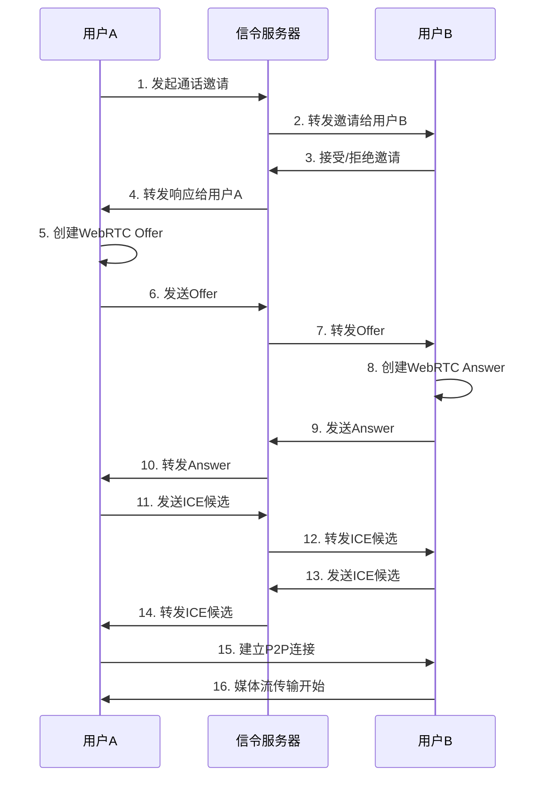
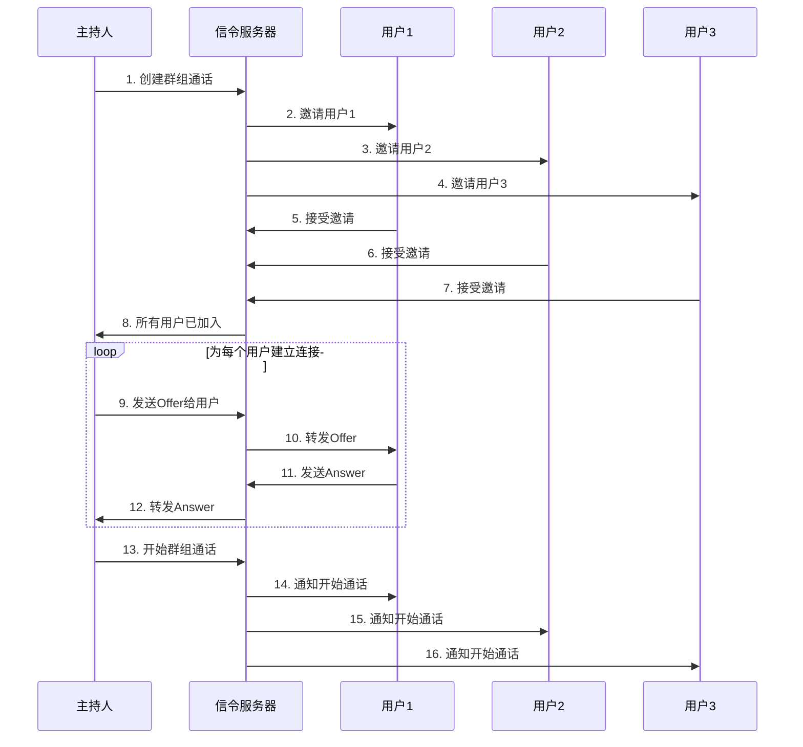
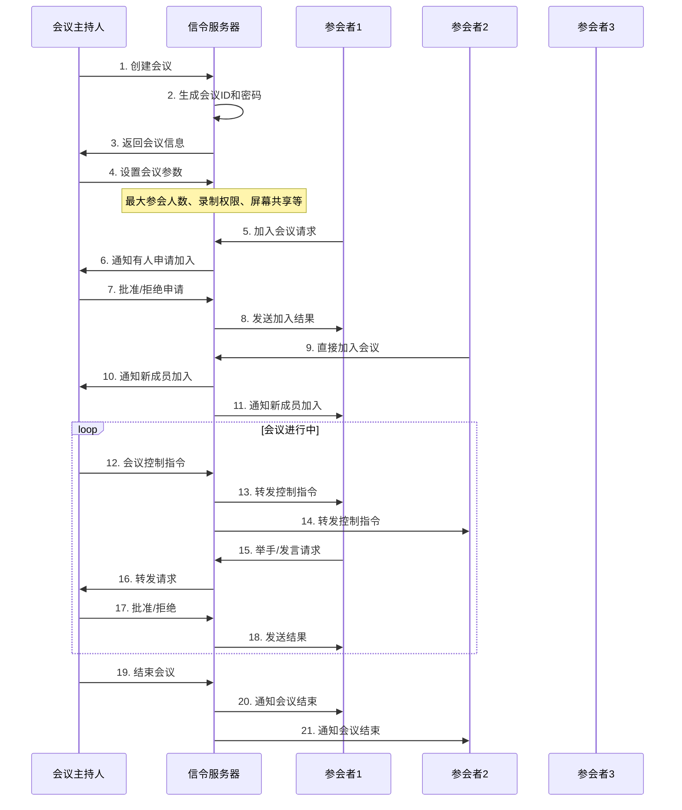
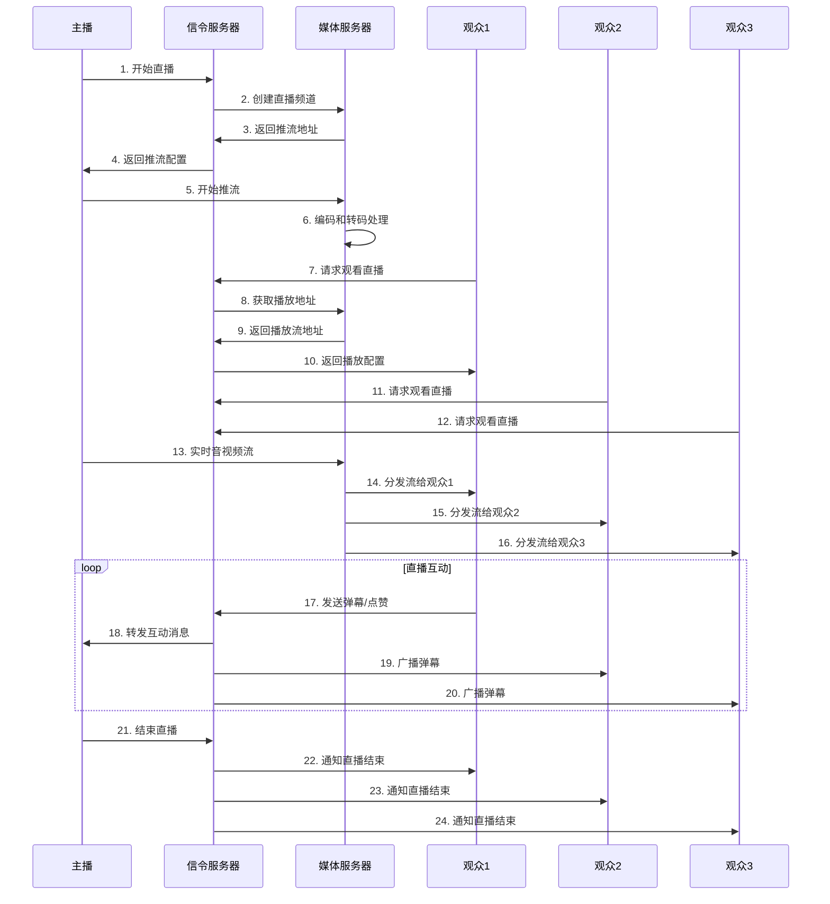
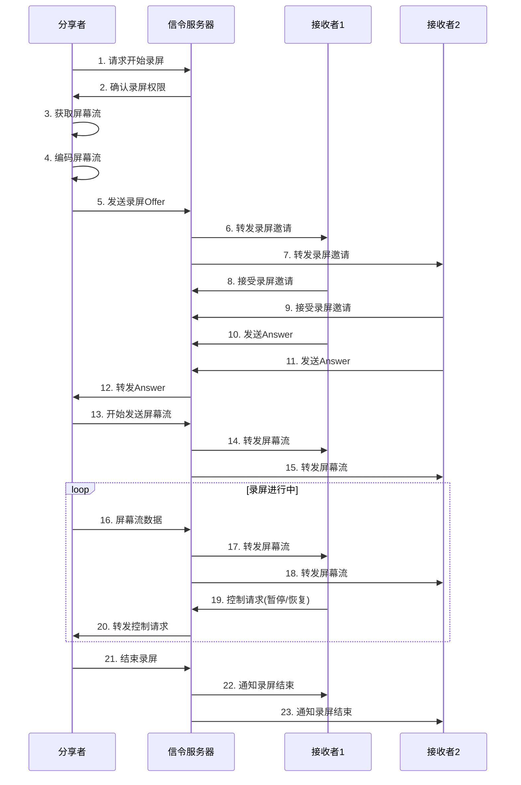

# 🚀 HiChat 流媒体服务

> 基于 WebRTC 的实时音视频通话微服务，支持一对一通话、群组通话、会议、录屏和直播功能

## 📋 目录

- [🎯 功能特性](#-功能特性)
- [🏗️ 架构设计](#️-架构设计)
- [🔧 技术栈](#-技术栈)
- [📁 项目结构](#-项目结构)
- [🚀 快速开始](#-快速开始)
- [💡 核心原理](#-核心原理)
- [📡 API 接口](#-api-接口)
- [🧪 测试验证](#-测试验证)
- [⚙️ 配置说明](#️-配置说明)
- [🔍 故障排除](#-故障排除)

## 🎯 功能特性

### 核心功能
- ✅ **一对一通话** - 支持点对点音视频通话
- ✅ **群组通话** - 支持多人同时通话
- ✅ **会议功能** - 完整的会议管理和控制
- ✅ **录屏分享** - 实时屏幕共享
- ✅ **直播功能** - 支持直播推流和观看

### 高级特性
- 🔄 **自动重连** - 网络中断自动恢复
- 🎛️ **媒体控制** - 静音、视频开关、音量调节
- 🏠 **房间管理** - 动态房间创建和用户管理
- 📊 **实时监控** - 连接状态和性能监控
- 🔒 **安全连接** - WebRTC 加密传输

## 🏗️ 架构设计

### 整体架构
```
┌─────────────────┐    WebSocket     ┌──────────────────┐
│   客户端 (前端)   │ ◄─────────────► │   信令服务器      │
└─────────────────┘    信令协商       └──────────────────┘
         │                                        │
         │ WebRTC (P2P)                          │ 业务逻辑
         ▼                                        ▼
┌─────────────────┐                        ┌──────────────┐
│   媒体流传输     │                        │ 房间/通话管理  │
│  (音视频数据)    │                        │ SFU 转发     │
└─────────────────┘                        └──────────────┘
```

### 分层设计

#### 1. 信令层 (Signaling Layer)
- **协议**: WebSocket over TCP
- **功能**: 连接协商、房间管理、用户管理
- **端口**: 10093

#### 2. 媒体层 (Media Layer)  
- **协议**: WebRTC over UDP
- **功能**: 实际音视频数据传输
- **特点**: P2P 直连，低延迟

#### 3. 业务层 (Business Layer)
- **房间管理**: 创建、删除、用户进出
- **通话管理**: 一对一、群组通话
- **会议管理**: 会议创建、控制、录制
- **媒体管理**: 录屏、直播、媒体控制

## 🔧 技术栈

### 后端技术
- **语言**: Go 1.19+
- **框架**: go-zero (微服务框架)
- **WebRTC**: pion/webrtc (WebRTC 库)
- **WebSocket**: gorilla/websocket
- **日志**: zap (结构化日志)

### 前端技术
- **WebRTC API**: 浏览器原生支持
- **WebSocket**: 信令通信
- **JavaScript**: ES6+ 现代语法

### 基础设施
- **数据库**: MySQL (用户数据)
- **缓存**: Redis (会话管理)
- **消息队列**: RabbitMQ (异步处理)

## 📁 项目结构

```
apps/streaming/
├── etc/                          # 配置文件
│   └── streaming-local.yaml     # 本地开发配置
├── internal/                     # 内部实现
│   ├── config/                  # 配置结构
│   ├── handler/                 # HTTP/WebSocket 处理器
│   ├── logic/                   # 业务逻辑
│   ├── svc/                     # 服务上下文
│   └── types/                   # 类型定义
├── webrtc/                      # WebRTC 连接管理
│   └── connection.go           # 连接封装
├── room/                        # 房间管理
│   ├── room.go                 # 房间实现
│   └── manager.go              # 房间管理器
├── sfu/                         # 选择性转发单元
│   └── sfu.go                  # SFU 实现
├── example/                     # 示例和测试
│   ├── client.html             # 客户端示例
│   ├── quick_test.html         # 快速测试
│   └── comprehensive_test.html # 完整测试
├── streaming.go                 # 服务入口
├── README.md                    # 本文档
├── ARCHITECTURE.md              # 架构说明
├── TECHNICAL_ANALYSIS.md        # 技术分析
└── API_EXAMPLES.md              # API 示例
```

## 🚀 快速开始

### 1. 环境要求
- Go 1.19+
- MySQL 5.7+
- Redis 6.0+

### 2. 安装依赖
```bash
# 安装 Go 依赖
go mod tidy

# 确保依赖已安装
go mod download
```

### 3. 配置服务
编辑 `etc/streaming-local.yaml`:
```yaml
Name: streaming.service
ListenOn: 0.0.0.0:10093

# WebRTC 配置
WebRTC:
  IceServers:
    - URLs:
        - "stun:stun.l.google.com:19302"
        - "stun:stun1.l.google.com:19302"

# SFU 配置
SFU:
  MaxRooms: 1000
  MaxUsersPerRoom: 50
  RoomTimeout: 3600
  UserTimeout: 300
```

### 4. 启动服务
```bash
# 启动流媒体服务
go run streaming.go -f etc/streaming-local.yaml

# 预期输出
Streaming service started successfully!
WebSocket endpoint: ws://0.0.0.0:10093/ws
Press Ctrl+C to stop the service
```

### 5. 测试连接
打开浏览器访问 `example/quick_test.html`，点击"连接测试"验证服务。

## 💡 核心原理

### 1. 一对一通话数据流

#### 信令流程


**💡 详细步骤解释：**

```javascript
// 步骤1-4: 通话邀请协商
// 1. 用户A发起邀请
const inviteMessage = {
    type: 'call_invite',
    user_id: 'userA',
    data: { callee_id: 'userB' }
};
// 目的: 通知用户B有人要和他通话

// 2-4. 服务器转发邀请和响应
// 目的: 确保双方都同意建立通话连接

// 步骤5-10: WebRTC连接协商
// 5. 用户A创建Offer (SDP描述)
const offer = await peerConnection.createOffer({
    offerToReceiveAudio: true,  // 接收音频
    offerToReceiveVideo: true   // 接收视频
});
// 目的: 告诉用户B自己支持的媒体格式和能力

// 6-7. 发送Offer给用户B
await peerConnection.setLocalDescription(offer);
// 目的: 让用户B知道用户A的媒体配置

// 8. 用户B创建Answer
const answer = await peerConnection.createAnswer();
// 目的: 根据用户A的Offer，确认自己的媒体配置

// 9-10. 发送Answer给用户A
await peerConnection.setRemoteDescription(answer);
// 目的: 完成媒体格式协商，双方都知道对方的配置

// 步骤11-14: ICE候选交换 (网络连接建立)
// 11. 用户A发送ICE候选
peerConnection.onicecandidate = (event) => {
    if (event.candidate) {
        // 发送候选到用户B
        signalingServer.send({
            type: 'ice_candidate',
            candidate: event.candidate
        });
    }
};
// 目的: 告诉用户B如何通过网络连接到用户A

// 12-14. ICE候选交换完成
peerConnection.addIceCandidate(remoteCandidate);
// 目的: 建立最佳的网络连接路径 (直连/中继)

// 步骤15-16: P2P连接建立
// 15. WebRTC自动选择最佳连接方式
// - 直连 (最低延迟)
// - STUN服务器穿透 (中等延迟)  
// - TURN服务器中继 (最高延迟但最可靠)

// 16. 开始媒体流传输
const localStream = await navigator.mediaDevices.getUserMedia({
    video: true,
    audio: true
});
// 目的: 开始传输实际的音视频数据
```

#### 媒体流架构
```
用户A ────────── P2P直连 ────────── 用户B
  │                                    │
  ├─ 音频流 (48kHz, 立体声)             ├─ 音频流
  ├─ 视频流 (720p, 30fps)              ├─ 视频流
  └─ 控制信令 (静音、视频开关)          └─ 控制信令
```

### 2. 群组通话数据流

#### 信令流程


**💡 详细步骤解释：**

```javascript
// 步骤1-7: 群组通话创建和邀请
// 1. 主持人创建群组通话
const groupCall = {
    type: 'group_create',
    host_id: 'host123',
    participants: ['user1', 'user2', 'user3']
};
// 目的: 创建多人通话房间，设置参与者列表

// 2-4. 服务器批量邀请所有参与者
participants.forEach(userId => {
    signalingServer.send({
        type: 'group_invite',
        target_user: userId,
        group_id: groupCall.id,
        host_info: { name: '主持人' }
    });
});
// 目的: 通知所有参与者加入群组通话

// 5-7. 参与者响应邀请
const response = {
    type: 'group_join',
    user_id: userId,
    group_id: groupCall.id,
    status: 'accepted'
};
// 目的: 确认参与者同意加入群组通话

// 步骤8: 确认所有用户加入
// 8. 服务器统计加入人数
if (joinedUsers.length === invitedUsers.length) {
    // 所有人已加入，可以开始通话
}
// 目的: 确保所有参与者都准备好了

// 步骤9-12: 建立SFU连接 (关键差异!)
// 9-12. 主持人需要与SFU服务器建立连接
const sfuConnection = new WebRTCConnection({
    type: 'sfu_publisher',  // 作为发布者
    room_id: groupCall.id
});

// 每个参与者也要与SFU建立连接
const participantConnection = new WebRTCConnection({
    type: 'sfu_subscriber', // 作为订阅者
    room_id: groupCall.id
});
// 目的: 建立到SFU服务器的连接，而不是P2P连接

// 步骤13-16: 开始群组通话
// 13. 主持人通知SFU开始转发
sfuServer.startForwarding({
    room_id: groupCall.id,
    participants: joinedUsers
});
// 目的: 让SFU开始为这个房间转发媒体流

// 14-16. 通知所有参与者开始接收
participants.forEach(user => {
    signalingServer.send({
        type: 'group_call_start',
        user_id: user.id,
        room_id: groupCall.id,
        sfu_endpoint: sfuServer.getEndpoint()
    });
});
// 目的: 告诉每个参与者开始接收SFU转发的媒体流

// 关键差异说明:
// - 一对一: P2P直连，延迟最低
// - 群组通话: SFU转发，支持多人但延迟稍高
// - 每个用户只与SFU连接，不与其他用户直接连接
```

#### SFU媒体流架构
```
┌─────────┐    ┌─────────┐    ┌─────────┐    ┌─────────┐
│  主持人   │    │  用户1   │    │  用户2   │    │  用户3   │
└────┬────┘    └────┬────┘    └────┬────┘    └────┬────┘
     │              │              │              │
     │ 媒体流        │ 媒体流        │ 媒体流        │ 媒体流
     ▼              ▼              ▼              ▼
┌─────────────────────────────────────────────────────────┐
│                    SFU 服务器                          │
│                                                         │
│  ┌─────┐  ┌─────┐  ┌─────┐  ┌─────┐                  │
│  │解码H│  │解码1│  │解码2│  │解码3│                  │
│  └──┬──┘  └──┬──┘  └──┬──┘  └──┬──┘                  │
│     │        │        │        │                     │
│  ┌──▼──┐  ┌──▼──┐  ┌──▼──┐  ┌──▼──┐                  │
│  │编码H│  │编码1│  │编码2│  │编码3│                  │
│  └─────┘  └─────┘  └─────┘  └─────┘                  │
│     │        │        │        │                     │
│     └────────┼────────┼────────┘                     │
│              │        │                              │
│              ▼        ▼                              │
│        选择性转发处理                                  │
└─────────────────────────────────────────────────────────┘
     │              │              │              │
     │ 转发流        │ 转发流        │ 转发流        │ 转发流
     ▼              ▼              ▼              ▼
┌─────────┐    ┌─────────┐    ┌─────────┐    ┌─────────┐
│  主持人   │    │  用户1   │    │  用户2   │    │  用户3   │
└─────────┘    └─────────┘    └─────────┘    └─────────┘
```

### 3. 会议功能数据流

#### 会议信令流程


#### 会议媒体流架构
```
┌─────────────────────────────────────────────────────────┐
│                    会议系统架构                         │
├─────────────────────────────────────────────────────────┤
│  主持人控制层                                            │
│  ├─ 会议管理 (创建/结束/设置)                            │
│  ├─ 成员管理 (邀请/踢出/权限)                            │
│  ├─ 媒体控制 (静音全体/开启视频)                          │
│  └─ 录制管理 (开始/停止录制)                             │
├─────────────────────────────────────────────────────────┤
│  SFU媒体处理层                                           │
│  ┌─────────┐  ┌─────────┐  ┌─────────┐                │
│  │主持人流  │  │参会者1流 │  │参会者2流 │                │
│  └────┬────┘  └────┬────┘  └────┬────┘                │
│       │            │            │                     │
│       ▼            ▼            ▼                     │
│  ┌─────────────────────────────────────┐                │
│  │        选择性转发处理                │                │
│  │  ┌─────┐ ┌─────┐ ┌─────┐ ┌─────┐  │                │
│  │  │解码 │ │解码 │ │解码 │ │编码 │  │                │
│  │  └─────┘ └─────┘ └─────┘ └─────┘  │                │
│  └─────────────────────────────────────┘                │
├─────────────────────────────────────────────────────────┤
│  参会者层                                               │
│  ┌─────────┐  ┌─────────┐  ┌─────────┐                │
│  │主持人   │  │参会者1   │  │参会者2   │                │
│  └─────────┘  └─────────┘  └─────────┘                │
└─────────────────────────────────────────────────────────┘
```

### 4. 直播功能数据流

#### 直播信令流程


#### 直播媒体流架构
```
┌─────────────────────────────────────────────────────────┐
│                      直播系统架构                       │
├─────────────────────────────────────────────────────────┤
│  主播端                                                 │
│  ┌─────────┐    ┌─────────┐    ┌─────────┐            │
│  │摄像头   │───▶│ 编码器   │───▶│ 推流器   │            │
│  └─────────┘    └─────────┘    └────┬────┘            │
│  ┌─────────┐    ┌─────────┐         │                 │
│  │麦克风   │───▶│ 音频编码 │─────────┘                 │
│  └─────────┘    └─────────┘                          │
├─────────────────────────────────────────────────────────┤
│  媒体服务器                                             │
│  ┌─────────────────────────────────────────────────────┐│
│  │  ┌─────┐  ┌─────┐  ┌─────┐  ┌─────┐               ││
│  │  │接收 │  │解码 │  │转码 │  │分发 │               ││
│  │  └─────┘  └─────┘  └─────┘  └─────┘               ││
│  │     │        │        │        │                  ││
│  │     ▼        ▼        ▼        ▼                  ││
│  │  ┌─────────────────────────────────────────────┐  ││
│  │  │         多码率自适应处理                    │  ││
│  │  │  ┌─────┐ ┌─────┐ ┌─────┐ ┌─────┐          │  ││
│  │  │  │1080p│ │720p │ │480p │ │360p │          │  ││
│  │  │  └─────┘ └─────┘ └─────┘ └─────┘          │  ││
│  │  └─────────────────────────────────────────────┘  ││
│  └─────────────────────────────────────────────────────┘│
├─────────────────────────────────────────────────────────┤
│  观众端                                                 │
│  ┌─────────┐  ┌─────────┐  ┌─────────┐  ┌─────────┐  │
│  │观众1    │  │观众2    │  │观众3    │  │观众N    │  │
│  └────┬────┘  └────┬────┘  └────┬────┘  └────┬────┘  │
│       │            │            │            │       │
│       ▼            ▼            ▼            ▼       │
│  ┌─────────┐  ┌─────────┐  ┌─────────┐  ┌─────────┐  │
│  │播放器   │  │播放器   │  │播放器   │  │播放器   │  │
│  └─────────┘  └─────────┘  └─────────┘  └─────────┘  │
└─────────────────────────────────────────────────────────┘
```

### 5. 录屏分享数据流

#### 录屏信令流程


#### 录屏媒体流架构
```
┌─────────────────────────────────────────────────────────┐
│                    录屏分享架构                         │
├─────────────────────────────────────────────────────────┤
│  分享者端                                               │
│  ┌─────────┐    ┌─────────┐    ┌─────────┐            │
│  │屏幕捕获 │───▶│ 视频编码 │───▶│ 流处理   │            │
│  └─────────┘    └─────────┘    └────┬────┘            │
│  ┌─────────┐    ┌─────────┐         │                 │
│  │音频捕获 │───▶│ 音频编码 │─────────┘                 │
│  └─────────┘    └─────────┘                          │
├─────────────────────────────────────────────────────────┤
│  SFU服务器                                              │
│  ┌─────────────────────────────────────────────────────┐│
│  │  ┌─────┐  ┌─────┐  ┌─────┐  ┌─────┐               ││
│  │  │接收 │  │解码 │  │转码 │  │分发 │               ││
│  │  └─────┘  └─────┘  └─────┘  └─────┘               ││
│  │     │        │        │        │                  ││
│  │     ▼        ▼        ▼        ▼                  ││
│  │  ┌─────────────────────────────────────────────┐  ││
│  │  │        多分辨率适配处理                     │  ││
│  │  │  ┌─────┐ ┌─────┐ ┌─────┐                 │  ││
│  │  │  │4K   │ │1080p│ │720p │                 │  ││
│  │  │  └─────┘ └─────┘ └─────┘                 │  ││
│  │  └─────────────────────────────────────────────┘  ││
│  └─────────────────────────────────────────────────────┘│
├─────────────────────────────────────────────────────────┤
│  接收者端                                               │
│  ┌─────────┐  ┌─────────┐  ┌─────────┐                │
│  │接收者1  │  │接收者2  │  │接收者N  │                │
│  └────┬────┘  └────┬────┘  └────┬────┘                │
│       │            │            │                     │
│       ▼            ▼            ▼                     │
│  ┌─────────┐  ┌─────────┐  ┌─────────┐                │
│  │播放器   │  │播放器   │  │播放器   │                │
│  └─────────┘  └─────────┘  └─────────┘                │
└─────────────────────────────────────────────────────────┘
```

### 6. 数据流对比总结

| 功能类型 | 信令复杂度 | 媒体流复杂度 | 服务器负载 | 延迟特点 |
|----------|------------|--------------|------------|----------|
| **一对一通话** | 简单 | 低 (P2P) | 低 | 最低 |
| **群组通话** | 中等 | 高 (SFU) | 高 | 中等 |
| **会议功能** | 高 | 高 (SFU+控制) | 高 | 中等 |
| **直播功能** | 中等 | 高 (推流+分发) | 最高 | 较高 |
| **录屏分享** | 中等 | 高 (屏幕流) | 高 | 中等 |

### SFU 架构原理

```
┌─────────┐    ┌─────────┐    ┌─────────┐
│ 用户A    │    │ 用户B    │    │ 用户C    │
└────┬────┘    └────┬────┘    └────┬────┘
     │              │              │
     │ 媒体流        │ 媒体流        │ 媒体流
     ▼              ▼              ▼
┌─────────────────────────────────────────┐
│            SFU 服务器                   │
│  ┌─────┐  ┌─────┐  ┌─────┐            │
│  │解码A│  │解码B│  │解码C│            │
│  └──┬──┘  └──┬──┘  └──┬──┘            │
│     │        │        │               │
│  ┌──▼──┐  ┌──▼──┐  ┌──▼──┐            │
│  │编码A│  │编码B│  │编码C│            │
│  └─────┘  └─────┘  └─────┘            │
└─────────────────────────────────────────┘
     │              │              │
     │ 转发流        │ 转发流        │ 转发流
     ▼              ▼              ▼
┌─────────┐    ┌─────────┐    ┌─────────┐
│ 用户A    │    │ 用户B    │    │ 用户C    │
└─────────┘    └─────────┘    └─────────┘
```

## 📡 API 接口

### WebSocket 信令消息

#### 基础消息格式
```json
{
  "type": "消息类型",
  "user_id": "用户ID",
  "room_id": "房间ID",
  "data": {},
  "timestamp": "2025-01-01T00:00:00Z"
}
```

#### 主要消息类型

**房间管理**
```json
// 加入房间
{
  "type": "join_room",
  "user_id": "user123",
  "room_id": "room456",
  "timestamp": "2025-01-01T00:00:00Z"
}

// 离开房间
{
  "type": "leave_room",
  "user_id": "user123",
  "room_id": "room456",
  "timestamp": "2025-01-01T00:00:00Z"
}
```

**通话管理**
```json
// 一对一通话邀请
{
  "type": "call_invite",
  "user_id": "caller123",
  "data": {
    "callee_id": "callee456"
  },
  "timestamp": "2025-01-01T00:00:00Z"
}
```

**会议管理**
```json
// 创建会议
{
  "type": "meeting_create",
  "user_id": "host123",
  "data": {
    "title": "项目讨论会",
    "description": "讨论项目进度",
    "settings": {
      "max_participants": 10,
      "allow_screen_share": true,
      "allow_recording": true
    }
  },
  "timestamp": "2025-01-01T00:00:00Z"
}
```

详细API文档请参考 [API_EXAMPLES.md](docs/API_EXAMPLES.md)

## 🧪 测试验证

### 1. 快速测试
```bash
# 启动服务
go run streaming.go -f etc/streaming-local.yaml

# 打开浏览器测试
open example/quick_test.html
```

### 2. 完整功能测试
```bash
# 打开完整测试页面
open example/comprehensive_test.html

# 点击"开始完整测试"验证所有功能
```

### 3. 手动测试
```javascript
// 在浏览器控制台运行
const ws = new WebSocket('ws://localhost:10093/ws');
ws.onopen = () => {
    console.log('连接成功');
    ws.send(JSON.stringify({
        type: 'join_room',
        user_id: 'test_user',
        room_id: 'test_room',
        timestamp: new Date().toISOString()
    }));
};
ws.onmessage = (event) => console.log('收到:', event.data);
```

## ⚙️ 配置说明

### 核心配置项

```yaml
# 服务配置
Name: streaming.service
ListenOn: 0.0.0.0:10093

# WebRTC 配置
WebRTC:
  IceServers:           # ICE 服务器列表
    - URLs:
        - "stun:stun.l.google.com:19302"
        - "turn:your-turn-server.com:3478"
      Username: "username"
      Credential: "password"
  Media:               # 媒体配置
    Video:
      Width: 1280      # 视频宽度
      Height: 720      # 视频高度
      FrameRate: 30    # 帧率
      Bitrate: 1000000 # 码率 (bps)
    Audio:
      SampleRate: 48000 # 采样率
      Channels: 2       # 声道数
      Bitrate: 128000   # 码率 (bps)

# SFU 配置
SFU:
  MaxRooms: 1000         # 最大房间数
  MaxUsersPerRoom: 50    # 每房间最大用户数
  RoomTimeout: 3600      # 房间超时时间(秒)
  UserTimeout: 300       # 用户超时时间(秒)

# 信令服务器配置
Signaling:
  WebSocket:
    ReadBufferSize: 4096   # 读缓冲区大小
    WriteBufferSize: 4096  # 写缓冲区大小
    CheckOrigin: true      # 检查来源
  MessageQueue:
    BufferSize: 1000       # 消息队列大小
    WorkerCount: 10        # 工作协程数
```

## 🔍 故障排除

### 常见问题

#### 1. WebSocket 连接失败
```bash
# 检查服务是否启动
curl -I http://localhost:10093

# 检查端口是否被占用
netstat -an | findstr :10093
```

#### 2. ICE 连接失败
- 检查 STUN/TURN 服务器配置
- 确认网络防火墙设置
- 验证 ICE 服务器可达性

#### 3. 媒体流无法传输
- 检查浏览器权限设置
- 确认摄像头/麦克风权限
- 验证 WebRTC 连接状态

#### 4. 房间管理异常
- 检查 Redis 连接状态
- 验证房间配置参数
- 查看服务端日志

### 日志分析

#### 启用详细日志
```yaml
# 在配置文件中设置日志级别
Log:
  Level: debug
```

#### 关键日志信息
```bash
# WebSocket 连接日志
WebSocket connection established

# 消息接收日志  
Received WebSocket message: type=join_room

# 消息处理日志
Handling signaling message: type=join_room

# 错误日志
Failed to upgrade websocket connection
```

## 📚 更多文档

- [架构设计](docs/ARCHITECTURE.md) - 详细的架构说明
- [技术分析](docs/TECHNICAL_ANALYSIS.md) - 技术选型和实现细节
- [API 示例](docs/API_EXAMPLES.md) - 完整的 API 使用示例

## 🤝 贡献指南

1. Fork 项目
2. 创建功能分支 (`git checkout -b feature/AmazingFeature`)
3. 提交更改 (`git commit -m 'Add some AmazingFeature'`)
4. 推送到分支 (`git push origin feature/AmazingFeature`)
5. 开启 Pull Request

## 📄 许可证

本项目采用 MIT 许可证 - 查看 [LICENSE](../LICENSE) 文件了解详情

---

**🎉 现在你已经了解了 HiChat 流媒体服务的完整架构和功能！开始构建你的实时音视频应用吧！**