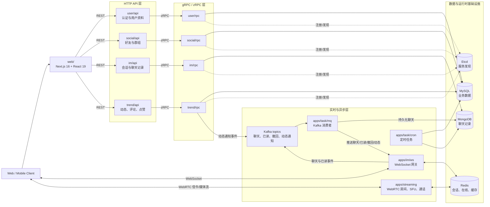
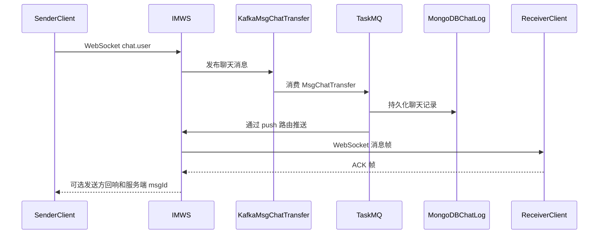
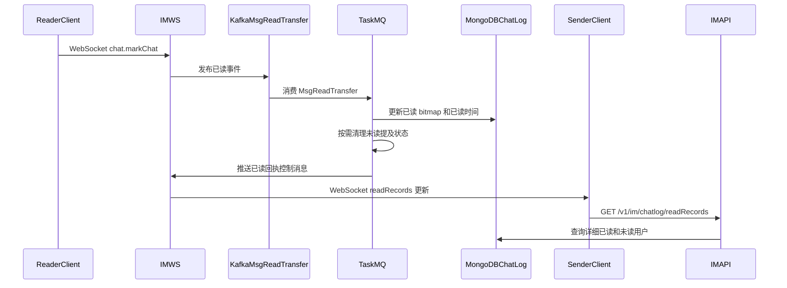
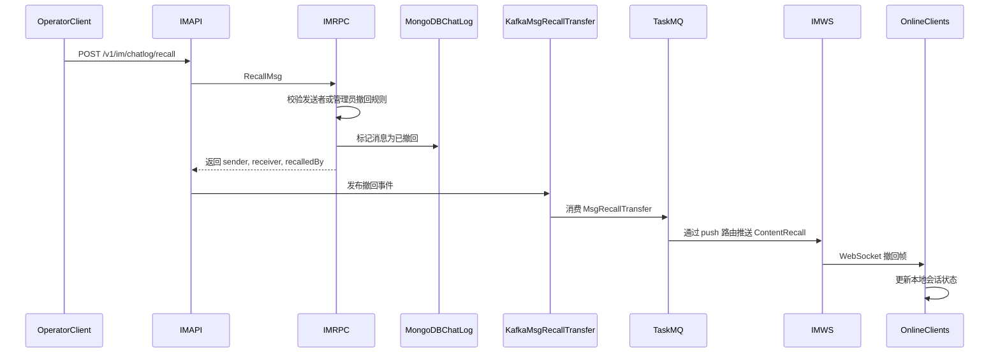
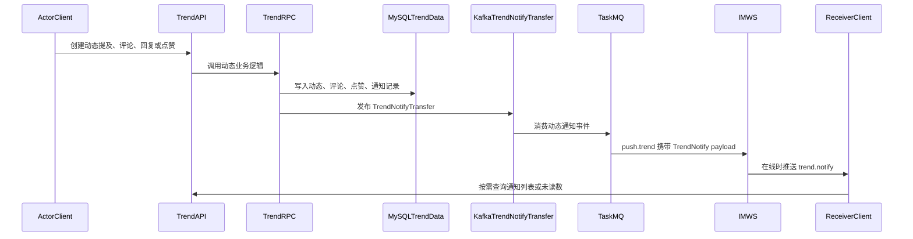

# go-hichat-api

[English](../README.md) | [简体中文](README.zh-CN.md)

go-hichat-api 是 HiChat 2.0 的后端与 Web 客户端仓库，是一个基于 Go、go-zero、WebSocket、Kafka 和 WebRTC 构建的微服务即时通讯与社交平台。

项目将用户身份、社交关系、会话、消息投递、动态流、异步任务和实时音视频拆分为独立服务。它可以作为构建现代 IM 系统的实践参考，覆盖 HTTP API、gRPC 服务边界、聊天记录持久化、在线状态、已读回执、消息确认、动态通知和 Next.js Web 客户端。


## 项目亮点

- 基于 go-zero REST 和 zRPC 的微服务架构。
- 通过 `.api` 和 `.proto` 文件维护 API 优先的服务契约。
- WebSocket 网关支持 IM 长连接、心跳、在线状态、消息 ACK、已读回执和实时推送。
- 基于 Kafka 的异步消息链路，处理聊天投递、已读事件、消息撤回和动态通知。
- MongoDB 存储聊天记录，MySQL 存储业务数据。
- Redis 存储会话、在线状态、缓存和运行时状态。
- 独立 WebRTC 流媒体服务，支持通话、房间、会议、屏幕共享和直播。
- `web/` 下提供完整 Web 客户端，技术栈为 Next.js 16、React 19、Bun、TypeScript、Tailwind CSS 和 Semi UI。

## 功能清单

### 用户与账号

- 使用手机号和密码注册、登录。
- 签发 JWT Token，并返回过期时间信息。
- 发送和验证手机验证码。
- 发送和验证邮箱验证码。
- 通过手机号或邮箱验证码重置密码。
- 查询当前用户资料。
- 更新昵称、手机号、头像、性别、简介、地区、职业、个人标签、密码和朋友圈封面。
- 上传用户头像。
- 绑定或更新邮箱。
- 按昵称模糊搜索用户，按手机号、邮箱和用户 ID 列表精确搜索用户。
- 通过注销/删除流程注销当前账号。
- 提供按用户 ID、手机号、邮箱查询用户的内部 RPC 能力，用于跨服务信息补全。

### 社交关系

- 发送好友申请，支持申请消息和预设备注。
- 同意、拒绝、忽略、标记已读、列表查询和删除好友申请。
- 统计未读好友申请消息数。
- 查询好友列表，并返回补全后的用户资料。
- 更新好友备注。
- 双向删除好友关系。
- 拉黑或取消拉黑好友。
- 设置好友朋友圈权限：允许、仅聊天、屏蔽朋友圈。
- 开启或关闭好友消息通知、置顶和静音。
- 管理好友标签。
- 举报好友，并预留好友分享流程。
- 查询好友在线状态。

### 群组

- 创建群组，支持名称和图标。
- 按群号精确搜索或按群名模糊搜索群组，支持分页。
- 申请入群、邀请成员入群、通过邀请 token 入群。
- 处理入群申请，并从群组或用户视角查询申请列表。
- 查询已加入群组和群成员列表。
- 查询群详情，包含群信息和成员信息。
- 查询群成员在线状态。
- 退出群组、踢出成员、邀请好友入群。
- 更新群名称、图标、公告文本、入群验证模式和描述。
- 解散群、转让群主、设置或取消管理员。
- 创建、查询、撤销和使用邀请链接或二维码 token，支持过期时间和最大使用次数。
- 管理成员自己的群昵称和群备注。
- 提供群 `@成员` 候选列表。
- 发布群公告、查询公告历史、置顶或取消置顶公告。
- 查询成员角色，用于权限判断。

### 即时通讯

- 创建单聊和群聊会话。
- 按用户查询和更新会话列表。
- 设置会话置顶或免打扰。
- 使用 MongoDB 存储聊天记录。
- 按会话、消息 ID、时间范围、数量和方向查询聊天记录，方向支持 older、newer 和 around。
- 支持文本、文件、语音、图片和视频消息类型。
- 支持引用/回复消息。
- 支持群聊 `@成员` 和 `@所有人` 元数据。
- 跟踪未读状态和单条消息已读记录。
- 查询单条消息的已读和未读用户列表。
- 标记消息已读，并通过异步链路推送已读回执。
- 获取群聊中未读的 `@我` 消息，用于快速跳转。
- 通过控制帧撤回消息，并携带操作者信息，支持发送者或管理员撤回场景。
- 上传图片、视频、语音和普通文件等富媒体资源。

### WebSocket 网关

- 认证 WebSocket 客户端。
- 使用 Redis TTL 维护在线状态并持续刷新。
- 注册 `user.online`、`chat.ping`、`chat.user`、`chat.markChat`、`push` 和 `push.trend` 路由。
- 将客户端聊天消息从 WebSocket 投递到 Kafka。
- 将 Kafka 消费到的聊天消息从服务端推送到在线客户端。
- 将动态通知与聊天会话解耦后独立推送。
- 支持可配置 ACK 级别、ACK 序列跟踪、重试、超时处理和重复消息过滤。
- 处理消息已读事件并投递到 MQ。
- 推送点赞、评论、回复、动态 @ 和评论 @ 等动态通知。

### 动态空间

- 创建文本、图文、长文、分享、视频和广告类型动态。
- 配置可见范围：仅自己、仅好友、公开。
- 关联图片/视频资源、封面 URL、分享 URL、位置、坐标、设备、IP、标题和 @ 用户。
- 删除和更新动态。
- 设置动态置顶、调整可见范围、开启或关闭评论。
- 按游标分页、类型过滤、排序和用户过滤查询动态列表。
- 获取最新动态流和用户主页动态。
- 获取动态详情。
- 获取发布配置，例如媒体数量/大小限制、允许类型、压缩开关和审核开关。
- 上传动态媒体，并返回内容类型、大小、宽高、时长和封面 URL 等元数据。
- 保存、获取和删除动态草稿。

### 评论、点赞与动态通知

- 创建一级评论和子评论。
- 获取完整评论树、一级评论和子评论列表。
- 删除评论。
- 将评论通知标记为已读。
- 点赞或取消点赞。
- 获取单条动态或批量动态的点赞摘要。
- 查询点赞用户列表。
- 获取未读回复和未读点赞通知。
- 将点赞通知标记为已读。
- 存储和查询动态消息通知。
- 获取动态消息未读数，并返回按类型拆分的明细。
- 将全部动态消息标记为已读。
- 将动态通知事件投递到 Kafka，并通过 WebSocket 推送给在线用户。

### 异步任务

- 消费 Kafka 聊天投递消息。
- 持久化聊天消息并转发给 WebSocket 客户端。
- 消费已读消息，更新已读记录 bitmap，并发送已读回执。
- 消费撤回消息并推送撤回控制帧。
- 消费动态通知消息并推送活动通知。
- 运行 cron 任务管理器，内置示例任务、统计任务和数据清理任务。
- 提供扩展点用于添加更多定时任务。

### 流媒体

- 提供独立 WebRTC 流媒体服务。
- 支持一对一通话、群组通话、会议、屏幕共享和直播流程。
- 使用 WebSocket 信令协商通话，使用 WebRTC 传输媒体流。
- 管理房间、用户、通话、会议、屏幕共享和直播。
- 包含面向房间媒体转发的 SFU 相关组件。
- 提供快速测试和完整测试浏览器页面。

### Web 客户端

- `web/` 下提供 Next.js 16 应用。
- 前端技术栈为 React 19 和 TypeScript。
- 使用 Bun 管理安装、开发、构建和生产启动脚本。
- 使用 Tailwind CSS 和 Semi UI 构建界面。
- 前端开发服务默认运行在 `3001` 端口。

## 架构



核心基础设施：

- MySQL 存储用户、好友、群组、动态等业务数据。
- MongoDB 存储聊天记录。
- Redis 存储会话、在线状态、缓存和运行时状态。
- Etcd 提供 go-zero 服务注册与发现。
- Kafka 解耦聊天投递、已读事件、撤回事件和动态通知处理。

## 消息链路

### 聊天消息投递



### 已读回执链路



### 消息撤回链路



### 动态通知链路



## 服务列表

| 服务 | 层 | 职责 |
| --- | --- | --- |
| `user` | `api`, `rpc`, `models` | 账号、认证、资料、验证码、用户查询 |
| `social` | `api`, `rpc`, `socialmodels` | 好友、好友申请、群组、群成员、邀请链接、群公告 |
| `im` | `api`, `rpc`, `ws`, `models`, `immodels` | 会话、聊天记录、已读回执、消息撤回、WebSocket 网关 |
| `trend` | `api`, `rpc`, `models` | 动态、评论、点赞、草稿、媒体、动态通知 |
| `task` | `mq`, `cron` | Kafka 消费者和定时任务 |
| `streaming` | `internal`, `room`, `sfu`, `webrtc` | WebRTC 通话、房间、会议、屏幕共享、直播 |
| `demo` | 独立示例 | 内部 demo 服务，不属于主启动脚本 |

## 技术栈

- 后端：Go 1.23、toolchain Go 1.24.2、go-zero、zRPC、gRPC、goctl。
- 实时通信：WebSocket、Kafka、WebRTC、Pion。
- 存储：MySQL、MongoDB、Redis。
- 服务发现：Etcd。
- 前端：Next.js 16、React 19、Bun、TypeScript、Tailwind CSS、Semi UI。

## 仓库结构

```text
apps/                  后端服务
  user/                用户 API、RPC 和模型
  social/              社交关系 API、RPC 和模型
  im/                  IM API、RPC、模型和 WebSocket 网关
  trend/               动态 API、RPC 和模型
  task/                MQ 消费者和 cron 任务
  streaming/           WebRTC 流媒体服务
  demo/                内部 demo 服务
deploy/                SQL、Dockerfile 和部署资源
docs/                  项目文档
web/                   Next.js Web 客户端
hichat2.sh             本地多服务启动脚本
```

## 快速开始

### 前置依赖

- Go 1.23 或更高版本，使用 toolchain Go 1.24.2。
- Web 客户端需要 Bun。
- MySQL、Redis、Etcd、MongoDB 和 Kafka。
- go-zero 工具链：`goctl`、`protoc`、`protoc-gen-go` 和 `protoc-gen-go-grpc`。

详细本地依赖安装命令见 `development-guide.md`。

### 启动后端服务

在基础设施启动后，运行主后端服务：

```bash
./hichat2.sh
```

该脚本会启动 user、social、IM、task 和 trend 服务，并将日志写入 `logs/`。

按需手动启动单个服务：

```bash
go run apps/<service>/<layer>/<service>.go -f apps/<service>/<layer>/etc/<service>-sample.yaml
```

单独启动 streaming 服务：

```bash
apps/streaming/start.sh
```

### 启动 Web 客户端

```bash
cd web
bun install
bun dev
```

Web 开发服务默认运行在 `3001` 端口。

## 开发
代码生成、数据库模型生成、Docker 示例和本地中间件配置见：
- [开发指南](development-guide.md)：本地中间件配置、go-zero 工具链、代码生成、启动说明和 Docker 示例。
- [API 文档](api.md)：生成的 REST 和 gRPC 契约汇总。

## 测试

在仓库根目录运行后端测试：

```bash
go test ./... -count=1
```

在 `web/` 下运行前端 lint：

```bash
bun lint
```

## 许可证

本项目基于 [Apache License 2.0](../LICENSE) 开源。

## 贡献
请参考 [贡献指南](https://github.com/iceymoss/go-hichat-api/issues/207) 了解贡献规范。
