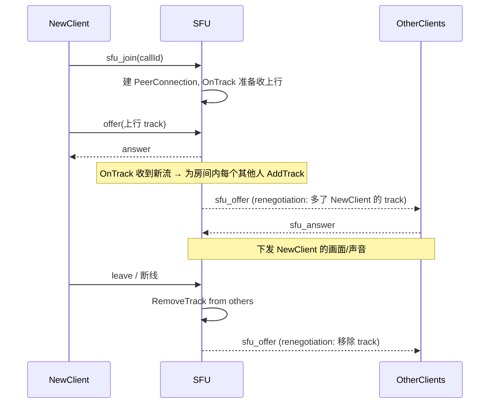

# Streaming SFU 群组 / 会议 / 直播底座

## 状态
- 创建日期: 2026-06-20
- 状态: 草稿（待审）
- 关联: [streaming-audio-video-call.md](streaming-audio-video-call.md)（§3 预留 SFU/会议/直播）、群组 Mesh 已交付（commit `03f817e`…`80566ba`）

## 0. 背景与现状（以代码为准）

- 群组通话已用 **Mesh 全连接**交付并实测（≤4 人，两两 P2P）。Mesh 上行带宽随人数线性增长，**硬上限 4 人**，无法支撑会议/直播/大群。
- `apps/streaming/sfu/sfu.go` 有 **SFU 骨架**：`SFU/RoomSFU/UserSFU{peerConn, tracks}`、`HandleMediaStream/ForwardMediaStream/AddUserToRoom/RemoveUserFromRoom/GetRoomStats/cleanupRoutine` 已写，但 **`OnTrack` 收流、转发接线、重协商全部未接到 signaling**，是空跑骨架。
- `apps/streaming/room/{manager.go,room.go}`、`apps/streaming/webrtc/connection.go` 有 Room/连接管理骨架。
- 信令协议（`types.go`、`CallSignal.MediaMode=p2p/mesh/sfu`、`Room.mode`）已为 SFU 预留字段。

**一句话**：要把「服务端中转选择性转发」真正接起来——每人只上行一路、由 SFU 按需下发给其他人——以突破 Mesh 的人数墙，并为会议/直播铺底座。

## 1. Mesh vs SFU（为什么必须换）

```
Mesh（现状, ≤4）            SFU（本 spec, 可扩到几十人）
A ── B                      A ─┐
│ ╲╱ │                      B ─┤→ [SFU 服务器] →（选择性下发）→ A B C D…
│ ╱╲ │                      C ─┤   每人上行 1 路，下行按需 N-1 路
D ── C                      D ─┘
每人上行 N-1 路（爆炸）      每人上行恒为 1 路（线性可扩）
```

- **SFU = Selective Forwarding Unit**：服务端为每个参与者建一条 PeerConnection，`OnTrack` 收其上行流，再 `AddTrack` **转发**给其他参与者。服务端**只转发、不解码不混流**（区别于 MCU），CPU 轻、可扩。
- **代价**：有人进/出 → 服务端要给每条连接加/减 track → **触发 WebRTC 重协商**（renegotiation：SFU 发新 offer，客户端 answer）。这是 SFU 最易错、最需要联调的部分。

## 2. 目标

- 群组通话突破 4 人墙：服务端 pion SFU 选择性转发，支持「会议级」人数（MVP 目标见 §13）。
- 复用已交付的群通话 UI / 振铃 / 记录 / 横幅，仅把**媒体层**从 Mesh 切到 SFU（`Room.mode` 切换，前端引擎分流）。
- 打通重协商：进/出房间动态加减 track + 稳定的 offer/answer 时序（perfect negotiation）。
- 为**会议**（主持人控制、静音全员、举手）与**直播**（1 publisher + N subscriber + 可选 HLS/CDN）预留 Room 抽象与协议位。

## 3. 非目标（预留）
- ❌ Simulcast / SVC（分层编码按带宽降级）——大规模高质量必备，但本期先单层，留扩展。
- ❌ 服务端录制 / 转码 / 混流（MCU 能力）。
- ❌ 拥塞控制 / 带宽估计（BWE）/ 丢包重传（NACK/PLI 仅做基本）的深度优化。
- ❌ 会议管理全集（等候室、白板、共享）、直播 CDN/HLS 切片——本期只铺 Room 底座。
- ❌ 多 SFU 节点级联（cascading）/ 跨区域。

## 4. 架构决策（核心，先读这一节）

### 4.1 ⚠️ 自建 pion SFU vs 采用成熟 SFU（最关键决策，需你拍板）

生产级「会议/直播」的**主流做法是采用成熟 SFU，而非手写**——因为健壮 SFU 要处理 simulcast、带宽自适应、丢包恢复、拥塞控制，手写工作量巨大且易踩坑。两条路：

| 维度 | A. 自建 pion SFU（接现有骨架） | B. 采用 LiveKit（Go/pion 内核，开源自托管） |
|------|------------------------------|------------------------------------------|
| 工作量 | 大（重协商/转发/稳定性全自己扛） | 中（部署 LiveKit + 接其 token/房间 API + 前端换 SDK） |
| 可控性 | 完全可控、贴合本仓教学性质 | 依赖 LiveKit，但生产特性开箱即用（simulcast/BWE/录制/HLS） |
| 生产成熟度 | 需长期打磨 | 已被大量生产采用 |
| 与现有代码 | 复用 `sfu/`+`room/` 骨架 | 基本替换 streaming 媒体层，信令改走 LiveKit |
| 适合 | 想「自己拥有并理解」一套 SFU | 想「快速上生产级会议/直播」 |

> 推荐：若目标是**尽快拿到生产级会议/直播** → **B (LiveKit)**；若目标是**自研掌控 + 贴合本项目教学定位** → **A (pion 自建)**。  
> 其余章节（§4.2 起）按 **A 自建 pion** 展开（因为它要写的代码多、要 spec 清楚；B 路线的接入要点见 §4.5）。

### 4.2 媒体层切换：Room.mode（不破坏 1:1 与小群 Mesh）
- `Room.mode ∈ {p2p, mesh, sfu}`。1:1 恒 `p2p`；群组按**人数阈值**决定：`≤ MeshMax(默认4)` 走 mesh（现状），`> MeshMax` 走 sfu。阈值可配。
- 前端：保留 `GroupCallEngine`(mesh)，**新增 `SfuCallEngine`**（与 SFU 协商而非两两 P2P）。`call-store` 按下发的 `mediaMode` 选引擎。**Mesh 路径零回归**。

### 4.3 SFU 信令（在 streaming ws 上新增，复用 relay 通道思路）
```
sfu_join{callId}        → 服务端 AddUserToRoom，建该用户的 SFU PeerConnection
sfu_offer / sfu_answer  → 重协商（注意：SFU 可能是 offerer，客户端要支持被动 answer）
ice_candidate(to=sfu)   → 与 SFU 的 ICE
track_published{uid}    → 通知房间「某人开始上行」（前端建对应下行 tile）
```

### 4.4 重协商时序（perfect negotiation，最易错处）

- 客户端用 **perfect negotiation**（polite peer）处理 SFU 主动发起的 renegotiation，避免 glare。
- 每次加减 track 都要重协商；**批量进出要去抖**（合并短时间内的多次重协商）以免风暴。

### 4.5 若选 B（LiveKit）的接入要点（备选）
- 部署 LiveKit server（自托管，Apache-2.0）；streaming 仅负责签发 LiveKit **房间 JWT**（room/identity/grant）。
- 前端用 `livekit-client` SDK，房间 = 群通话 callId；publish 本地轨、subscribe 远端轨，simulcast/BWE/重协商 SDK 内建。
- 群通话 UI/振铃/记录/横幅复用；媒体层换 SDK。1:1 可仍走现有 P2P 或一并并入。

## 5. 用户故事
- 作为**群成员**，5 人以上发起群通话也能顺畅看到所有人音视频（不再卡 4 人上限）。
- 作为**会议召集人**（后续），我能开一个房间让 N 人加入、看到网格、（后续）静音某人/全员。
- 作为**主播**（后续），我推一路流，观众只订阅不上行（1 publisher + N subscriber）。

## 6. 核心流程（SFU 群通话，自建路线）
见 §4.4 时序图。要点：每人**上行恒 1 路**到 SFU；下行由 SFU 按房间成员**选择性转发**；进/出触发对其余成员的重协商。

## 7. 异常处理
| 场景 | 处理 |
|------|------|
| 重协商 glare（双方同时 offer） | perfect negotiation：客户端为 polite，回滚自己的 offer 接受 SFU 的 |
| 某客户端 answer 超时 | SFU 重试一次 → 仍失败则视为该订阅失败，不阻塞房间其他人 |
| 上行者断线 | SFU OnTrack 关闭 → RemoveTrack + 对其余人重协商（移除其 tile） |
| 房间空/人数 < 阈值回落 | 可选：人数降回 ≤MeshMax 时**不**自动切回 mesh（避免抖动），维持 sfu 至通话结束 |
| SFU 节点过载 | `GetRoomStats` + 上限保护（maxRooms/maxUsersPerRoom，骨架已有），超限拒绝加入 + 提示 |
| 客户端在对称 NAT 后 | 与 SFU 之间同样需要 **TURN**（见 [streaming-turn-relay.md](streaming-turn-relay.md)）；SFU 一般有公网 IP，srflx 多数可达 |

## 8. 技术设计（自建 pion 路线）

### 8.1 复用/补全骨架
- `sfu/sfu.go`：接 `peerConn.OnTrack`（收上行）→ 读 RTP 写入 `TrackLocalStaticRTP` → `ForwardMediaStream` 给房间其他人；补 **重协商触发**（加减 track 后置 renegotiation 标记，驱动 SFU 发 `sfu_offer`）。
- `room/`：复用 RoomManager 维护房间成员；与 `logic/groupcall.go` 的会话状态对齐（或合并，避免双份真相）。
- `webrtc/connection.go`：pion PeerConnection 工厂（ICE 配置复用 §TURN 下发的 servers）。

### 8.2 signaling.go 新分支
- `route()` 加 `sfu_join/sfu_offer/sfu_answer`、`ice_candidate(to=sfu)`。
- 与现有 mesh 的 `group_*` 并存：`Room.mode==sfu` 的群通话走 SFU 分支，`mesh` 走现有分支。

### 8.3 前端 `SfuCallEngine`
- 一条到 SFU 的 PeerConnection；publish 本地轨；`ontrack` 收到下行 → 按 `track_published{uid}` 映射到 participant tile（复用 `call-store.participants` 形状 + CallOverlay 网格）。
- perfect negotiation 处理 `sfu_offer`。
- 复用现有：媒体状态同步、加入横幅、通话记录、振铃。

### 8.4 配置
```yaml
WebRTC:
  Sfu:
    Enabled: false
    MeshMax: 4            # ≤ 走 mesh，> 走 sfu
    MaxUsersPerRoom: 16   # SFU 房间硬上限（MVP）
```

## 9. 实现步骤（每步可独立 commit；分支 `feat-streaming-sfu`；强烈建议白天逐步联调）

> ⚠️ SFU 重协商无法盲写过夜，需像 1:1 那样「写一点测一点」。建议开专门联调 session。

1. [ ] **决策 A/B**（§4.1）——先定路线，再动手。
2. [ ] (A) `webrtc` 工厂 + `sfu` `OnTrack`→转发单测/本地回环验证（先**纯音频、单房间、2 人**）。
3. [ ] (A) signaling `sfu_join/offer/answer` 接线，打通 2 人 SFU 音频。
4. [ ] (A) 前端 `SfuCallEngine` + perfect negotiation，2 人端到端音频通。
5. [ ] (A) 加视频；加第 3、4 人验证重协商（进/出加减 track）。
6. [ ] (A) `Room.mode` 阈值切换 + 与 mesh 并存（回归 1:1/小群）。
7. [ ] (A) 人数上限保护、异常路径、清理（断线 renegotiation）。
8. [ ] 文档 + 录屏验收。

## 10. 参考的现有模式
- `sfu/sfu.go`、`room/`、`webrtc/connection.go` — 现有骨架，本期补全接线。
- `group-call-engine.ts` / `peer-conn.ts` — 前端多连接管理与 offer/answer/ice 思路，SfuCallEngine 借鉴。
- `signaling.go` 的 `relayToPeer`/`group_*` — ws 分发与房间成员校验。
- pion 官方 `example-sfu-ws` — SFU 收发与重协商标准范式。
- （B 路线）LiveKit server + `livekit-client`。

## 11. 测试计划
- [ ] 单测：SFU 房间加减成员、track 映射、上限保护、清理。
- [ ] 联调：2→3→4→N 人逐级，重点验证**进/出时的重协商**不丢流、不卡死。
- [ ] 回归：1:1 与 ≤4 mesh 路径不受影响。
- [ ] 受限网络：客户端↔SFU 经 TURN（依赖 TURN spec 先行）。
- [ ] 压测（轻量）：单房间 N 人 CPU/带宽，确认 `MaxUsersPerRoom` 合理。

## 12. 待定事项（需你确认）
- **路线 A 自建 pion / B 采用 LiveKit**（§4.1）——这是开工前必须先定的。
- **MVP 人数目标**：会议级到多少人（8 / 16 / 更多）？决定是否当期就要 simulcast。
- **是否需要会议/直播能力本期就铺**，还是只先把「大群通话」做出来。
- **SFU 节点资源**：跑在哪、是否与现有服务同机；公网 IP（SFU 需可被客户端直达）。
- **是否依赖 TURN 先行**（建议先做 TURN，SFU 客户端连接更稳）。

## 13. MVP 范围（本期交付边界，自建路线）
✅ `Room.mode` 媒体层切换（1:1/mesh 零回归）
✅ pion SFU：选择性转发 + 进出重协商，**群通话突破 4 人**（目标 ≤ MaxUsersPerRoom，单层）
✅ 复用群通话 UI/振铃/记录/横幅/媒体状态同步
✅ 人数上限保护 + 断线清理

❌ simulcast/SVC、录制/转码、会议管理全集、直播 CDN/HLS、多 SFU 级联（均预留）
（若选 B：MVP = 部署 LiveKit + streaming 签发房间 token + 前端 SDK 接入，生产特性随 LiveKit 开箱）
