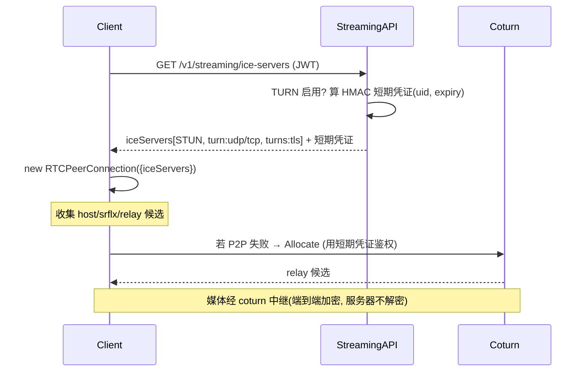

# Streaming TURN 中继接入

## 状态
- 创建日期: 2026-06-20
- 状态: 草稿（待审）
- 关联: [streaming-audio-video-call.md](streaming-audio-video-call.md)（§3 非目标已预留 TURN）、[streaming-call-REVIEW.md](streaming-call-REVIEW.md)（已知问题 #2：同机跨浏览器/对称 NAT 偶发连不上）

## 0. 背景与现状（以代码为准）

- `apps/streaming/internal/handler/iceserver.go::ICEServersHandler` 已下发 ICE 配置；当前仅返回 `WebRTC.IceServers` 配置项，空则回退公共 STUN（`defaultSTUN`）。
- `apps/streaming/etc/streaming-sample.yaml` 的 `WebRTC.IceServers` 已有 TURN **占位**，但用的是**静态 username/password**——明文写死、长期有效，生产不可用（泄露即被盗刷流量）。
- `config.go::WebRTC.IceServers[].{URLs,Username,Credential}` 结构已存在。
- 1:1 与群组 Mesh 媒体都是浏览器 P2P 直连；连不通的根因是**没有中继兜底**：同机 Chrome↔Safari 的 mDNS host 候选、企业/对称 NAT 下 srflx 也打不通时，没有 relay 候选可用。

**一句话**：通话能力已完整，缺的是「P2P 打不通时的中继兜底」。本 spec 部署 coturn + 下发**时限凭证**，把 ICE 候选补上 `relay` 一档。

## 1. 名词速记（30 秒）

- **STUN**：帮浏览器发现自己的公网映射地址（srflx 候选）。轻量，多数网络够用。**当前已有**。
- **TURN**：当 P2P 怎么都打不通时，媒体**经 TURN 服务器中继**（relay 候选）。耗带宽，但**保证连通**。是 STUN 的兜底超集（TURN 服务器同时也是 STUN 服务器）。
- **时限凭证（TURN REST API / RFC 5766 long-term cred 的标准用法）**：不下发固定密码，而是服务端用共享 `static-auth-secret` 算一个**短期** username/credential：
  - `username = "<到期unix时间戳>:<userId>"`
  - `credential = base64(HMAC-SHA1(static-auth-secret, username))`
  - coturn 用同一个 secret 校验，过期自动失效。**密钥永不下发给前端**。

## 2. 目标

- 部署 coturn，并让 `ICEServersHandler` 在 TURN 启用时**为每次请求动态下发短期 TURN 凭证**，前端拿到后直接喂给 `RTCPeerConnection`。
- 覆盖受限网络：对称 NAT、企业防火墙、同机跨浏览器、移动网络——P2P 打不通时自动走 relay。
- 支持 `turns:`（TLS over TCP/443），穿透只放行 443 的严格防火墙。
- 凭证短期有效、密钥不外泄、可灰度开关；TURN 不可用时**优雅回退** STUN（不阻断现有通话）。

## 3. 非目标（预留，不在本期）

- ❌ TURN 服务器**多区域/多节点负载均衡**、Anycast、GeoDNS（先单节点，够用即可）。
- ❌ TURN 流量计费/配额/防滥用限速（先靠短期凭证 + 防火墙端口控制；用量监控留 §11 待定）。
- ❌ 自建 TURN 的高可用集群（coturn + Redis 共享认证后续再上）。
- ❌ 改 `.env`；不引入新数据库表。

## 4. 架构决策（核心）

### 4.1 凭证模式：时限 HMAC（不是静态密码）
采用 coturn 的 `use-auth-secret` + `static-auth-secret`（业界标准「TURN REST API」做法，Twilio/Cloudflare/LiveKit 同款）。

```
前端发起通话前
  └─ GET /v1/streaming/ice-servers (JWT)
       └─ streaming: 若 TURN 启用 → 现算 username/credential（HMAC，TTL=可配，默认 1h）
            └─ 返回 [ STUN, turn:udp, turn:tcp, turns:tls ] + 短期凭证
  └─ new RTCPeerConnection({ iceServers })  // relay 候选随之生成
媒体打不通 P2P 时 → 经 coturn relay（服务端只转发加密媒体，不解密）
```

**为什么不用静态密码**：静态密码一旦随前端下发即等于公开，任何人可白嫖你的 TURN 带宽。时限凭证 1 小时自动失效，且**密钥只在服务端**。

### 4.2 凭证生成放在 streaming（复用现有下发接口）
不新增接口，扩展现有 `ICEServersHandler`：JWT 解析出 `uid` → 用 `uid` + 到期时间算 HMAC → 拼进返回的 iceServers。`uid` 入 username 便于 coturn 日志溯源。

### 4.3 回退策略（不破坏现有）
- `WebRTC.Turn.Enabled=false`（默认）→ 行为与现在**完全一致**（STUN-only）。
- `Enabled=true` 但算凭证异常 → 记日志 + 仍返回 STUN（不 500、不阻断通话）。

### 4.4 传输档位（前端 iceServers 一次给齐）
| URL | 用途 |
|-----|------|
| `stun:HOST:3478` | 轻量，多数情况够用 |
| `turn:HOST:3478?transport=udp` | 中继首选，延迟最低 |
| `turn:HOST:3478?transport=tcp` | UDP 被封时 |
| `turns:HOST:5349?transport=tcp` | 仅放行 443/TLS 的严格防火墙（TLS 端口建议 443） |

## 5. 用户故事

- 作为**企业内网/对称 NAT 后的用户**，我发起或接听通话时，即使 P2P 打不通也能正常通话（自动走中继），不再「响铃后黑屏/无声」。
- 作为**运维**，我能用一份 docker-compose 起 coturn，配一个 secret，改 streaming yaml 开开关即可上线，无需改代码。
- 作为**安全负责人**，下发给前端的 TURN 凭证 1 小时失效、密钥不出服务端，TURN 端口受防火墙控制。

## 6. 核心流程



## 7. 异常处理

| 场景 | 处理 |
|------|------|
| TURN 未启用 | 返回 STUN-only（现状），通话仍可用（仅受限网络可能连不上） |
| HMAC 计算/配置异常 | 记 error 日志 + 回退 STUN，不阻断 |
| 凭证过期 | 前端下次发起时重新拉取（凭证只在「发起通话前」取，单通话时长 < TTL 不受影响） |
| coturn 宕机 | ICE 协商超时 → 前端走现有 `call.err.connect`/超时路径；STUN 候选仍可能直连 |
| 群通话多人 | 每个浏览器各自拉凭证、各自与 coturn Allocate；coturn 按 uid 区分 |

## 8. 技术设计

### 8.1 配置（config.go + yaml，与现有字段一致风格）
```go
// config.go WebRTC 段新增
Turn struct {
    Enabled      bool     `yaml:"Enabled"`
    URLs         []string `yaml:"URLs"`          // turn:HOST:3478?transport=udp 等，HOST 用公网域名/IP
    StaticSecret string   `yaml:"StaticSecret"`  // 与 coturn static-auth-secret 一致；勿入库勿外泄
    Realm        string   `yaml:"Realm"`         // 与 coturn realm 一致
    TTLSeconds   int      `yaml:"TTLSeconds"`    // 凭证有效期，默认 3600
}
```
```yaml
# streaming-sample.yaml：把现有静态 TURN 占位替换为
WebRTC:
  Turn:
    Enabled: false                 # 部署 coturn 后置 true
    URLs:
      - "turn:turn.yourdomain.com:3478?transport=udp"
      - "turn:turn.yourdomain.com:3478?transport=tcp"
      - "turns:turn.yourdomain.com:5349?transport=tcp"
    StaticSecret: "REPLACE_WITH_LONG_RANDOM_SECRET"
    Realm: "hichat"
    TTLSeconds: 3600
```

### 8.2 凭证生成（新增 `handler/turncred.go`）
```go
// turnCredential 生成 coturn time-limited 凭证（TURN REST API 规范）
// username = "<expiry>:<uid>"; credential = base64(HMAC-SHA1(secret, username))
func turnCredential(uid, secret string, ttl time.Duration, now time.Time) (user, cred string)
```
纯函数、可单测（注入 now，不依赖时钟）。

### 8.3 ICEServersHandler 扩展
- 解析 JWT uid（已有 `auth.ParseUID`）。
- 若 `Turn.Enabled`：算一次凭证，把 `Turn.URLs` 拼成带 `username/credential` 的 ICEServer 追加到返回列表（STUN 在前、TURN 在后）。
- 否则维持现状。
- CORS / OPTIONS / 回退逻辑保持不变。

### 8.4 前端
- **零改动**：`call-engine.ts` / `group-call-engine.ts` 的 `loadIceServers()` 已经把整个 `iceServers` 透传给 `RTCPeerConnection`。下发里多了 TURN 项即自动生效。
- 可选：日志里打印是否拿到 relay 候选，便于联调（`onicecandidate` 里 `candidate.type === 'relay'`）。

### 8.5 coturn 部署（新增 `apps/streaming/deploy/coturn/`）
- `docker-compose.yml` + `turnserver.conf`：
  ```conf
  use-auth-secret
  static-auth-secret=REPLACE_WITH_LONG_RANDOM_SECRET   # 与 streaming yaml 一致
  realm=hichat
  listening-port=3478
  tls-listening-port=5349
  min-port=49160
  max-port=49200
  external-ip=<公网IP>                                  # 云主机需显式指定
  fingerprint
  no-multicast-peers
  # 生产：cert/pkey 配 turns TLS（Let's Encrypt）
  ```
- 防火墙放行：3478 udp/tcp、5349 tcp、49160-49200 udp（relay 端口段）。
- README：部署步骤 + secret 同步 + 自检命令（`turnutils_uclient` / Trickle ICE 页面验证 relay 候选）。

### 8.6 安全
- `StaticSecret` 长随机、只在服务端与 coturn；**不写日志、不下发、不入库、不进 git**（yaml 占位 + 部署时替换或走环境注入，遵循「不改 .env」）。
- TTL 默认 1h；username 内嵌 uid 便于审计与滥用溯源。
- 生产强烈建议启用 `turns:`（TLS）并用 443，兼顾穿透与加密。

## 9. 实现步骤（每步可独立 commit；分支 `feat-streaming-turn`）

1. [ ] config + yaml 加 `WebRTC.Turn`（保持向后兼容，默认关）。
2. [ ] `turncred.go` 凭证生成纯函数 + 单测（table-driven，注入 now，校验 HMAC 与过期）。
3. [ ] `ICEServersHandler` 接入：启用时追加 TURN 项 + 回退逻辑。
4. [ ] `deploy/coturn/`：docker-compose + turnserver.conf + README。
5. [ ] 前端可选：relay 候选诊断日志。
6. [ ] 联调验证（见 §11）+ 文档更新（REVIEW 已知问题 #2 标记解决）。

## 10. 参考的现有模式
- `handler/iceserver.go` — 下发结构、CORS、JWT 解析、STUN 回退，本期在其上扩展。
- `handler/auth.go::ParseUID` — JWT uid 解析。
- `handler/groupcall_http.go` — 新 HTTP handler 的写法（CORS/鉴权/WriteJson）。
- TURN REST API：coturn `use-auth-secret`；同 LiveKit/Twilio NTS 凭证机制。

## 11. 测试计划
- [ ] 单测：`turnCredential` 给定 secret/uid/now → 期望 username/credential（与 coturn 校验逻辑对齐）；过期边界。
- [ ] 集成：起 coturn，前端 Trickle ICE 工具验证能拿到 `relay` 候选。
- [ ] 端到端：两端**强制 relay**（Chrome `--force-... ` 或 `iceTransportPolicy:'relay'` 临时改）验证纯中继也能通话。
- [ ] 受限网络：手机热点 ↔ 公司网，验证之前连不上的场景现在通。
- [ ] 回退：`Enabled=false` 行为不变；凭证异常时仍返回 STUN。

## 12. 待定事项（需你确认）
- **coturn 部署在哪**：现有云主机/独立 VM？是否有公网 IP + 域名（`turns:` 要证书）？→ 决定 `external-ip` 与 TLS 配置。
- **自建 vs 托管**：自建 coturn（本 spec）/ 用 Cloudflare TURN / Twilio NTS（托管，免运维但按量计费）。若想零运维，可只做凭证下发对接托管商。
- **TTL**：默认 1h 是否合适。
- **用量监控/限额**：本期是否需要（默认不做，留扩展）。

## 13. MVP 范围（本期交付边界）
✅ coturn 单节点部署物料（compose + conf + README）
✅ streaming 下发 TURN **时限凭证**（HMAC，可开关，回退 STUN）
✅ 前端零改动自动生效 `turn:`/`turns:`
✅ 受限网络/纯 relay 端到端验证通过

❌ 多节点/高可用、计费限额、托管商对接、Anycast（均预留）
